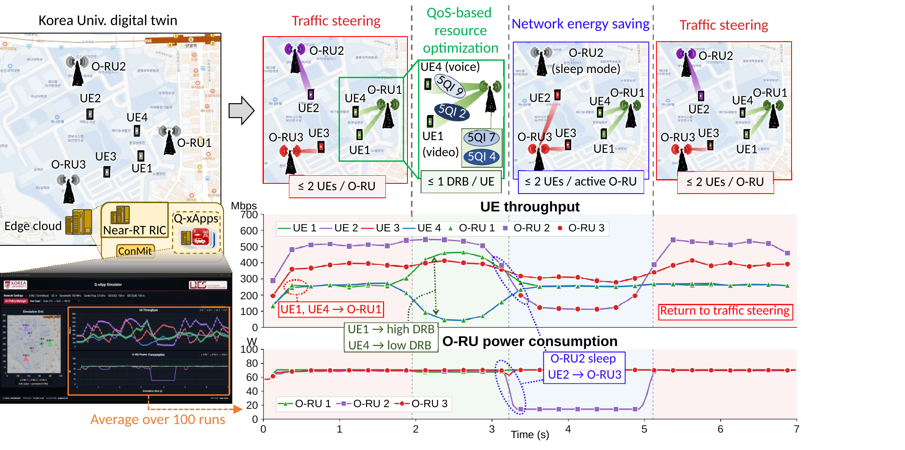
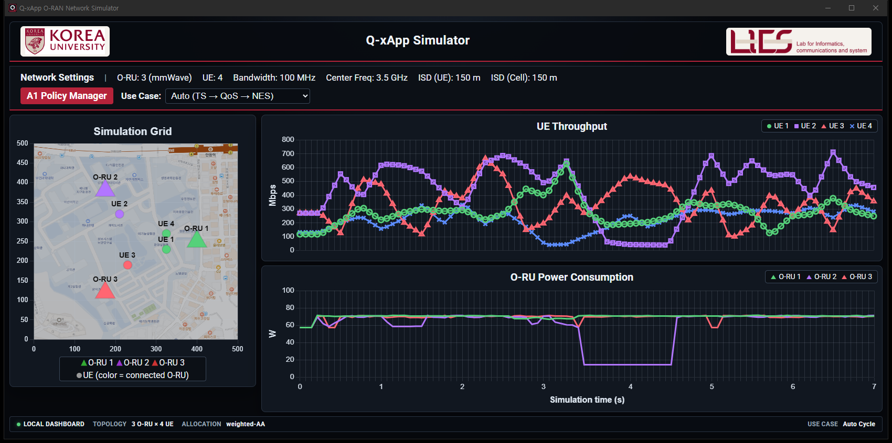
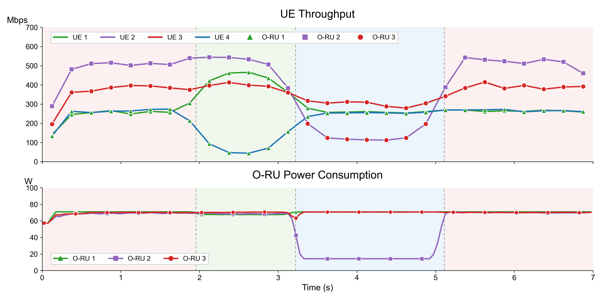
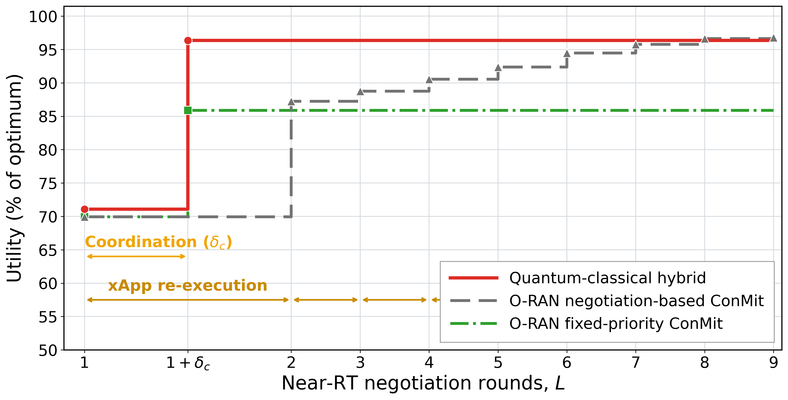

# Q-xApp: Realizing Quantum-Enabled Near-Real-Time RAN Control

Q-xApp is a reproducible hybrid quantum-classical framework that runs Traffic
Steering (TS), Network Energy Saving (NES), and QoS-based Resource Allocation
(QoS-RA) through one O-RAN xApp control pipeline. The implementation integrates
**ns-O-RAN**, **FlexRIC**, Qiskit statevector solvers, and a live Docker-backed
dashboard.



*Final manuscript Fig. 4 - Q-xApp implementation, near-RT control sequence, and
average network responses. The dark GUI at lower left is one representative
live 3-O-RU / 4-UE run; the response graph at lower right is the phase-aligned
mean of 100 independent weighted-AA runs. The GUI itself is not a 100-run
display.*

## Current release at a glance

| Area | Current canonical version |
|---|---|
| Simulator GUI | Final dark native Windows shell over the active FastAPI/Chart.js dashboard; one live 3-O-RU / 4-UE, 7 s Auto cycle |
| Fig. 4 | Final 100-run weighted-AA batch (`RngRun=1..100`); 100/100 `SMOKE=PASS`, no failed seeds, `fb_any=0` in every run |
| Fig. 5 | Final 2026-08-12 limited-projection release; seeds 0-99, 10 domains, 3 O-RUs per domain |
| Quantum execution | Ideal statevector / finite-shot amplified-probability simulation; no QPU or quantum-advantage claim |
| Reproducibility | Pinned upstream commits, install manifests, validation matrix, checksums, and frozen result releases |

**Start here:** [install](#7-installation) · [run](#8-running-the-simulation) ·
[GUI controls](#9-using-the-gui) ·
[validation evidence](docs/QUANTUM_VALIDATION.md) ·
[paper artifact map](docs/PAPER_ARTIFACTS.md) ·
[final Fig. 5 release](fig5/README.md)

---

## 1. What is Q-xApp?

Q-xApp demonstrates that diverse O-RAN near-RT RIC use cases share a common
**inter-entity assignment** structure. A single xApp changes the assignment
policy while retaining the same E2 measurement and control pipeline.

| Use case | Assignment | Control objective |
|---|---|---|
| **Traffic Steering (TS)** | UE <-> Cell | Assign UEs to high-rate cells under the A1 UE-per-cell cap |
| **Network Energy Saving (NES)** | UE <-> Cell | Consolidate UEs, then sleep an idle O-RU |
| **QoS-based Resource Allocation (QoS-RA)** | UE <-> DRB | Assign distinct DRBs using each UE's 5QI requirement |

The operator can switch policies in real time without restarting the xApp, or
use Auto mode to run the complete TS -> TS+QoS-RA -> NES -> TS sequence.

---

## 2. Current Simulator GUI

The current GUI is the dark interface in the lower-left panel of the final
manuscript Fig. 4. The full-resolution live-run capture is shown below. It is a
**single simulator run**, while the 100-run aggregate is a separate headless
batch result shown in the next section.



*One live Auto cycle: Simulation Grid, per-UE throughput, measured-profile
O-RU power, and real-time A1 policy control over the 0-7 s timeline.*

| Role | Canonical path |
|---|---|
| Native Windows shell | [`gui/desktop/qxapp_simulator.py`](gui/desktop/qxapp_simulator.py) |
| Windows launcher | [`gui/desktop/launch_qxapp_simulator.ps1`](gui/desktop/launch_qxapp_simulator.ps1) |
| Active dashboard template | [`gui/src/templates/chart.html`](gui/src/templates/chart.html) |
| Active API/data controller | [`gui/src/http/data_controller.py`](gui/src/http/data_controller.py) |
| Interactive ns-3 scenario | [`ns3/scenario/scenario-zero-with_parallel_loging.cc`](ns3/scenario/scenario-zero-with_parallel_loging.cc) |
| README screenshot | [`docs/assets/qxapp-simulator-dark.png`](docs/assets/qxapp-simulator-dark.png) |

### Launch the native Windows GUI

After completing the repository installation below, prepare the desktop shell
once from PowerShell:

```powershell
py -3 -m venv "$env:LOCALAPPDATA\QxAppDesktop\venv"
& "$env:LOCALAPPDATA\QxAppDesktop\venv\Scripts\python.exe" -m pip install -r .\gui\desktop\requirements.txt
```

Then launch it from the repository root:

```powershell
powershell -ExecutionPolicy Bypass -File .\gui\desktop\launch_qxapp_simulator.ps1
```

The launcher starts only the local WSL/Docker **dashboard backend**, waits for
`http://127.0.0.1:8000`, and opens it in the native shell. The nearRT-RIC,
ns-3 simulation, and Q-xApp controller still run as the three processes shown
in [Running the Simulation](#8-running-the-simulation). Its default WSL
distribution is `Ubuntu`; set `QXAPP_WSL_DISTRO` when another distribution name
is used. Pass `-Url http://127.0.0.1:8000/` for the full operator layout; the
default `?capture` URL uses the compact paper layout. The control endpoints are
intentionally bound to loopback and should not be exposed directly to an
external network. Desktop backend logs are written to
`%LOCALAPPDATA%\QxAppDesktop\backend.log`.

---

## 3. Paper Results

### Fig. 4 - End-to-end near-RT control

The Fig. 4 experiment runs the xApp in **Auto mode**, cycling through
**TS -> TS+QoS-RA -> NES -> TS** in the 3-O-RU / 4-UE, seven-second
`scenario-fig4-qxapp.cc`. The final batch contains **100 independent
weighted-AA runs** (`RngRun=1..100`). All 100 summaries report
`SMOKE=PASS`, the batch has no failed seeds, and every run records `fb_any=0`.
The frozen batch executed TS 17-qubit weighted-AA, NES 5-qubit weighted-AA,
and QoS-RA 8-qubit assignment circuits on Qiskit Statevector; this was not QPU
execution. These are the executed Fig. 4 circuit sizes, not a claim that every
solver file currently on `main` is byte-identical to the frozen batch source.



Each run is aligned to common display-phase boundaries before the plotted
throughput and power traces are averaged; this is a **phase-aligned mean**, not
a pointwise average of unaligned wall-clock events. The phase table below is
computed on each run's original, unwarped phase windows and reports population
mean +/- standard deviation in Mbps (`n=100`).

| Phase | UE1 | UE2 | UE3 | UE4 |
|---|---:|---:|---:|---:|
| TS | 258.78 +/- 22.30 | 508.61 +/- 33.98 | 380.27 +/- 52.50 | 261.79 +/- 22.95 |
| TS+QoS-RA | 440.57 +/- 58.71 | 516.67 +/- 56.92 | 396.40 +/- 79.66 | 71.47 +/- 19.22 |
| NES | 257.83 +/- 37.82 | 144.33 +/- 37.11 | 302.49 +/- 90.38 | 255.04 +/- 38.32 |
| Post-wake TS | 264.18 +/- 17.97 | 518.44 +/- 28.04 | 390.55 +/- 48.30 | 267.10 +/- 22.30 |

In the manuscript summary, QoS-RA changes UE1/UE4 from approximately
259/262 Mbps to 441/71 Mbps. During NES, UE2 moves from O-RU2 to O-RU3 and
falls to 144 Mbps; O-RU2 drops from approximately 69 W to the frozen 14.3 W
sleep value. The active calibration curve is 57.4/62.5/66.1/71.7 W at
0/30/50/100% load.

Canonical evidence: [per-seed phase means](fig4_ppt/runs_summary_100run.csv),
[aggregate statistics](fig4_ppt/phase_stats_raw_100run.txt),
[phase-alignment plotter](fig4_ppt/qxapp_fig4_plot_100run.py),
[frozen power model](fig4_ppt/oru_power_model_100run.json),
[execution provenance](fig4_ppt/PROVENANCE_100RUN.md), and
[checksums](fig4_ppt/SHA256SUMS_100run.txt).

```bash
# Protocol-level WSL rerun; edit the pinned REPO/NS paths for another host.
bash scripts/run_weighted_fig4_batch.sh 1 100 <batch-dir>
python fig4_ppt/qxapp_fig4_plot_100run.py <batch-dir> fig4_ppt
# Verify the stored public artifact from an LF-normalized checkout.
sha256sum -c fig4_ppt/SHA256SUMS_100run.txt
```

For execution identity, use the source hashes in
[`PROVENANCE_100RUN.md`](fig4_ppt/PROVENANCE_100RUN.md). The three solver blobs
with those exact hashes are retained at Git commit `2afabfe`; rerunning the
current `main` without restoring the frozen solver blobs is a new experiment,
not a bit-for-bit reproduction of the final-paper batch.

The earlier white GUI and 50-run plots remain only as historical evidence; the
[paper artifact map](docs/PAPER_ARTIFACTS.md) keeps them separate from the
current GUI and final 100-run result.

### Fig. 5 - Multi-Q-xApp coordination

The final Fig. 5 limited-projection release evaluates multi-Q-xApp coordination
over 100 matched network realizations (seeds 0-99). Ten Q-xApp domains are
arranged in a 2 x 5 grid, each with three O-RUs; the network contains 60
internal UEs and 26 boundary UEs. Its 1,024-shot ideal amplified-probability
candidate model is not a gate-level QPU execution.



At `L = 1`, the hybrid and Hungarian-based ConMit baselines reach 71.085% and
69.933% of the centralized optimum. Stored-output coordination raises the
hybrid to 96.365% at `1 + delta_c`; fixed-priority ConMit reaches 85.882%.
Negotiation-based ConMit first exceeds the hybrid's plotted mean at `L = 8`
(96.645%), after seven additional local executions. Its paired 95% confidence
interval includes zero, so this is a mean crossing rather than a statistically
significant superiority claim.

The complete frozen release, runner, audit outputs, source-bundle checksum, and
reproduction instructions are indexed in [`fig5/README.md`](fig5/README.md).

---

## 4. Current Quantum Circuits

Q-xApp documents two current weighted-amplitude-amplification circuits: the
controller-default assignment circuit and its weighted-resource extension.

| Circuit | Purpose | Status |
|---|---|---|
| **Assignment** | Assign 4 UEs to 3 O-RUs under a maximum-UE-per-O-RU constraint | Current TS controller default |
| **Assignment + Knapsack constraints** | Add heterogeneous UE PRB demands and an independent PRB budget for each O-RU | Explicit weighted-PRB validation path |

### Latest assignment circuit

The default TS solver is a **17-qubit full-state weighted-AA circuit** for the
4-UE x 3-O-RU assignment problem. Its register layout is 8 assignment qubits,
7 reusable constraint/utility qubits, one phase target, and one clean MCX
synthesis ancilla.

`V3^x4` prepares only the three valid O-RU labels for each UE. The state
preparation unitary `A` then computes the per-O-RU UE-cap constraint and
encodes the sum-rate preference with utility rotations. Adaptive amplitude
amplification samples feasible candidates; every candidate is checked again
classically, and the returned assignment is the candidate with the highest raw
sum rate.

- Implementation: [`dqna_ts.py`](flexric/xApp/dqna_ts.py)
- Resource profile: [`v5_resource_table.csv`](reports/v5_resource_table.csv)
- Current method: `quantum-fullA-17q-valid3-caponly-weightedAA-v5`

### Latest assignment circuit with Knapsack constraints

The weighted-resource extension turns the same UE-to-O-RU assignment into a
generalized-assignment / multiple-knapsack problem. For every O-RU `c`, the
reversible hard constraint is

```text
sum_u demand[u,c] * [UE u is assigned to O-RU c] <= budget[c].
```

The representative 4-UE x 3-O-RU circuit uses **18 qubits**: 8 assignment
qubits, a 5-qubit shared arithmetic/utility workspace, 3 violation qubits, one
phase target, and one clean synthesis ancilla. The weighted-PRB oracle rejects
assignments that exceed any O-RU budget, while the full-state weighted-AA path
amplifies feasible high-utility assignments and returns a classically verified
candidate.

- Implementation: [`dqna_modes.py`](flexric/xApp/dqna_modes.py) and
  [`dqna_constraints.py`](flexric/xApp/dqna_constraints.py)
- Mode: `--solver-mode weighted-aa --constraint-mode weighted-prb`
- Representative resources: 18 qubits, depth 10,726, and 9,355 CX gates at
  three amplification rounds in
  [`combined_circuit_resources.csv`](reports/combined_circuit_resources.csv)

The first circuit is the current GUI/controller TS path. The Knapsack-constrained
circuit is a separately selected validation path and is not the default Fig. 4
runtime. Both results use ideal Qiskit Statevector simulation; they are not QPU
executions and do not establish quantum computational advantage. The tracked
claim-to-command mapping is in
[`docs/validation_matrix.json`](docs/validation_matrix.json).

---

## 5. Architecture

```text
┌─────────────────────────────────────────────────────────────┐
│ Native dark shell (Windows / WebView2, optional)             │
│                     127.0.0.1:8000                            │
└──────────────────────────┬──────────────────────────────────┘
                           │ wraps the same loopback dashboard
┌──────────────────────────┴──────────────────────────────────┐
│             Docker GUI (FastAPI + Chart.js + InfluxDB)       │
│  ┌───────────┐  ┌────────────┐  ┌─────────────────────┐    │
│  │ Sim Grid  │  │ Throughput │  │ Cell Power          │    │
│  │ (Map+UE+  │  │  (Mbps)    │  │     (W)             │    │
│  │  O-RU)    │  │            │  │                     │    │
│  └───────────┘  └────────────┘  └─────────────────────┘    │
│  Network Settings: 3 O-RU, 4 UE, 100MHz, ISD 150m          │
│  A1 Policy Manager: [Use Case ▼] [Sleep O-RU / 5QI]        │
│                         InfluxDB                             │
└──────────────────────────┬──────────────────────────────────┘
                           │
┌──────────────────────────┴──────────────────────────────────┐
│                    FlexRIC nearRT-RIC                         │
│              ┌────────────┐  ┌───────────────┐               │
│              │  KPM SM    │  │    RC SM       │               │
│              └──────┬─────┘  └───────┬───────┘               │
└─────────────────────┼────────────────┼──────────────────────┘
        SINR reports  │                │ Control commands
┌─────────────────────┴────────────────┴──────────────────────┐
│              ns-3 mmWave Simulation                           │
│   O-RU 1 (Cell 2)   O-RU 2 (Cell 3)   O-RU 3 (Cell 4)     │
│        UE 1    UE 2    UE 3    UE 4    LTE (anchor)         │
└──────────────────────────┬──────────────────────────────────┘
                           ▼
┌─────────────────────────────────────────────────────────────┐
│           Q-xApp Unified Controller (Fig. 2 Pipeline)        │
│                                                               │
│   Stage 1              Stage 2              Stage 3          │
│  ┌───────────────┐  ┌────────────────┐  ┌────────────────┐  │
│  │ Use-Case      │  │ Assignment     │  │ Output         │  │
│  │ Encoder       │→│ Algorithm      │→│ Interpreter    │  │
│  │               │  │                │  │                │  │
│  │ Read SINR,    │  │ TS: best-SINR  │  │ Handover       │  │
│  │ A1 policy,    │  │ NES: energy    │  │ Sleep/Wake     │  │
│  │ QoS config    │  │ QoS-RA: DRB    │  │ DRB weight     │  │
│  └───────────────┘  └────────────────┘  └────────────────┘  │
└─────────────────────────────────────────────────────────────┘
```

---

## 6. Prerequisites

| Component | Repository | Branch | Pinned commit |
|-----------|-----------|--------|---------------|
| **ns-O-RAN** | https://github.com/Orange-OpenSource/ns-O-RAN-flexric | `main` | `4930827e126d` |
| ↳ submodule `mmwave-LENA-oran` | https://github.com/MinaYonan123/mmwave-LENA-oran | — | `0ae720c977ee` |
| ↳ submodule `e2sim-kpmv3` | https://github.com/MinaYonan123/e2sim-kpmv3 | — | `acf4f6b2baa8` |
| ↳↳ nested `contrib/oran-interface` | https://github.com/MinaYonan123/oran-interface | — | `0eedb5ff8e35` |
| ↳↳ nested `src/nr` | https://github.com/MinaYonan123/ns3-oran-lena-nr | — | `09a044894e8a` |
| **FlexRIC** | https://gitlab.eurecom.fr/mosaic5g/flexric | `oie-ric-taap-xapps` | `307e1d0a5c26` |
| **Docker** | Docker + Docker Compose | — | — |

Full 40-char commit SHAs, supported OS and toolchain versions are machine-readable in
[`install/upstream_manifest.json`](install/upstream_manifest.json). Install ns-O-RAN
(`git submodule update --init --recursive` — the nested `contrib/oran-interface` and
`src/nr` submodules are required to build) and FlexRIC at the pinned commits following
their respective guides first. Tested on **Ubuntu 24.04 (WSL2)**, Python 3.12.3,
gcc 13.3, cmake 3.28.

---

## 7. Installation

The install is manifest-driven: the exact upstream commits, the full 14-file
ns-3 overlay (source / destination / preimage / post-install SHA-256), the
complete xApp + solver file list and the solver environment lock live in
[`install/`](install/). The installer validates every file before copying
anything (no partial install) and refuses to overwrite a destination whose
content matches neither the recorded upstream preimage nor the expected
post-install hash.

```bash
# 1. ns-3 overlay (all 14 tracked files, preimage-verified; also checks the submodule pins)
python3 install/install_overlay.py --manifest install/overlay_manifest.json --dest <ns-O-RAN> --check   # dry run
python3 install/install_overlay.py --manifest install/overlay_manifest.json --dest <ns-O-RAN>

# 2. xApp + quantum solver files (exact list, incl. dqna_modes.py / dqna_constraints.py
#    and the ctrl CMakeLists.txt that adds the xapp_qxapp_* build targets)
python3 install/install_overlay.py --manifest install/xapp_manifest.json --dest <FlexRIC> --check
python3 install/install_overlay.py --manifest install/xapp_manifest.json --dest <FlexRIC>

# 3. Solver venv: locked validated environment (qiskit 1.2.4 / numpy 1.26.4),
#    runs `pip check` + all three solver CLI smoke tests, prints provenance
sudo bash install/setup_solver_venv.sh                    # default /root/qxapp-venv
# or any writable path: bash install/setup_solver_venv.sh <venv-dir> <FlexRIC>/examples/xApp/c/ctrl

# 4. Copy GUI
cp -r gui/* <ns-O-RAN>/GUI/

# 5. Build everything
cd <ns-O-RAN> && ./ns3 build
sudo bash -c 'cd <FlexRIC>/build && cmake -DKPM_VERSION=KPM_V3_00 -DE2AP_VERSION=E2AP_V1 .. && cmake --build . --target xapp_qxapp_unified -j$(nproc)'
cd <ns-O-RAN>/GUI && sudo docker compose up -d
```

### Runtime path injection

Host paths are injected via environment variables; unset means the historical
WSL layout, so existing deployments run unchanged.

| Variable | Meaning | Default |
|---|---|---|
| `QXAPP_DATA_DIR` | ns-3 run dir: CSV metrics, `xapp_*.txt` configs, `qxapp_result.json` | `/home/wookjin/ns-O-RAN-flexric/mmwave-LENA-oran` |
| `QXAPP_PY` | solver venv python used by the xApp | `/root/qxapp-venv/bin/python` |
| `QXAPP_TS_SCRIPT` / `QXAPP_42_SCRIPT` / `QXAPP_QOS_SCRIPT` | solver CLI paths | `<FlexRIC>/examples/xApp/c/ctrl/dqna_*.py` |
| `QXAPP_HOST_DATA` | docker-compose host mount backing the GUI `/host_data` | same as `QXAPP_DATA_DIR` default |

### O-RU power shown in the GUI

The current GUI and final 100-run Fig. 4 use the same frozen measured-profile
power model. The trace follows complete 50 ms intervals from the cumulative
ns-3 `energyfilecell*.csv` series and marks sleep only when ns-3 reports the
actual `es_state`; a requested target alone never forces the plotted drop.
The active curve maps 0/30/50/100% load to 57.4/62.5/66.1/71.7 W, and sleep is
14.3 W. If the interval-energy trace is temporarily unavailable, the GUI falls
back to per-cell DL PRB utilization.

The live chart commits complete 250 ms `DlPdcpStats.txt` bins and complete
50 ms power intervals on the fixed 0-7 s axis, preserving the wake/recovery
tail. Browser polling controls when a phase is finalized, not the coordinates
of the plotted samples. The frozen values are in
[`fig4_ppt/oru_power_model_100run.json`](fig4_ppt/oru_power_model_100run.json).

- [Li et al. (2025), measured multi-vendor O-RU power model](https://aetherproject.org/wp-content/uploads/sites/11/2025/11/IEEE_FNWF2025_Energy_Efficiency_Testing_and_Power_Modeling_of_O_RAN_Radio_Units_prepubln.pdf)
- [Usman et al. (2025), O-RU component model and advanced sleep](https://research.ucc.ie/en/publications/power-modeling-of-the-o-ran-o-ru-amp-application-of-advanced-slee-3/)

### What Each Modified File Does

The authoritative per-file list (all 14 ns-3 overlay files with purpose,
destination and SHA-256) is `install/overlay_manifest.json`; the table below
summarizes the main ones.

| File | Copies to | What was changed |
|------|----------|-----------------|
| `scenario-fig4-qxapp.cc` | `scratch/` | Fig.4 scenario: 3 O-RU, 4 UE, automated phases (TS → TS+QoS-RA → NES → TS), 7 s, energy model |
| `scenario-zero-with_parallel_loging.cc` | `scratch/` | GUI interactive demo: 3 O-RU, 4 UE, long-run, real-time use-case switching |
| `mmwave-enb-net-device.cc` | `src/mmwave/model/` | Added Energy_state sleep/wake + Radio_Bearer_Control handler |
| `mmwave-flex-tti-pf-mac-scheduler.cc/.h` | `src/mmwave/model/` | Added per-UE scheduling weight for QoS-RA |
| `qxapp_unified.c` | `examples/xApp/c/ctrl/` | Unified xApp: 3 use cases with Fig. 2 pipeline |
| `qxapp_common.h` | `examples/xApp/c/ctrl/` | Shared code: RC messages, CSV parsing, rate computation |
| `GUI/*` | `GUI/` | Web dashboard, Docker config, auto-start data pusher |

---

## 8. Running the Simulation

For an interactive GUI or one single-seed Fig. 4 run, open **three terminals**
and run in order:

```bash
# Terminal 1: Start the nearRT-RIC
sudo <FlexRIC>/build/examples/ric/nearRT-RIC

# Terminal 2: Start ns-3 network simulation (wait for E2 Setup to complete)
#   GUI interactive demo:
cd <ns-O-RAN> && ./ns3 run "scratch/scenario-zero-with_parallel_loging --N_MmWaveEnbNodes=3 --N_Ues=4"
#   or one automated Fig.4 seed after writing the Auto config shown below:
#   ./ns3 run "scratch/scenario-fig4-qxapp --N_MmWaveEnbNodes=3 --N_Ues=4 --simTime=7 --RngRun=1"

# Terminal 3: Start Q-xApp controller (after ns-3 connects to RIC)
sudo <FlexRIC>/build/examples/xApp/c/ctrl/xapp_qxapp_unified
```

The final Fig. 4 configuration is `auto`, max 2 UEs per O-RU, sleep target
cell 3 (O-RU2), 5QI values 2/4/7/9, and quantum enabled:

```bash
printf 'auto\n'  > <ns-O-RAN>/xapp_mode.txt
printf '2\n'     > <ns-O-RAN>/xapp_a1_policy.txt
printf '3\n'     > <ns-O-RAN>/xapp_sleep_config.txt
printf '2,4,7,9\n' > <ns-O-RAN>/xapp_qos_config.txt
printf '1\n'     > <ns-O-RAN>/xapp_quantum.txt
```

For the complete seeds 1-100 batch, use the batch/plot/checksum commands in
[Fig. 4 - End-to-end near-RT control](#fig-4---end-to-end-near-rt-control).

Then open **http://localhost:8000** in your browser. The Docker GUI and data pusher start automatically.

Switch use cases from the GUI at any time. The default mode is Traffic Steering.
On Windows, the native dark shell can be opened with the launcher documented
in [Current Simulator GUI](#2-current-simulator-gui); it presents the same
loopback dashboard and does not replace the three runtime processes above.

---

## 9. Using the GUI

### Network Settings (top bar)
Fixed simulation parameters: O-RU count, UE count, bandwidth, center frequency, inter-site distance.

### A1 Policy Manager (second bar)
Switch use cases and configure policies in real-time:

- **Auto mode**: initial TS -> QoS-RA on the TS placement -> NES -> wake and
  post-wake TS recovery. The selector abbreviates this as
  `Auto (TS -> QoS -> NES)`.
- **TS mode**: "Max UE/Cell" selector. Manual TS is real control, not a
  preview: the xApp recomputes the assignment under the selected cap,
  sends RC handovers for mismatched UEs and completes only after FRESH
  serving-cell measurements confirm each target. A structurally
  infeasible cap (cells × cap < UEs, e.g. cap = 1 with 4 UEs on 3 cells)
  is rejected fail-closed — no over-cap assignment is ever forced.
- **NES mode**: "Sleep O-RU" radio buttons — choose which O-RU to put to sleep
- **QoS-RA mode**: Per-UE 5QI selector (2, 4, 7, 9 — each unique). Manual
  QoS groups UEs by their MEASURED serving cell (not a virtual grouping)
  and sends per-UE DRB weight control.

The scenario dimension is fixed at 4 UEs × 3 O-RUs (the solvers and
result artifacts are sized to it); the GUI selectors change policy, not
the topology.

### Charts
| Chart | What it shows |
|-------|--------------|
| **Simulation Grid** | Campus map with O-RU (triangles, colored) and UE (circles, colored by serving cell). Sleeping O-RUs turn gray. |
| **Throughput** | Per-UE throughput in Mbps over time |
| **Cell Power** | Per-O-RU power in Watts from actual energy state, the ns-3 interval-energy shape, and a measured O-RU active/sleep calibration |

---

## 10. Technical Details

### Verification

Run the repository's quick checks with the locked solver environment:

```bash
PY=<solver-venv>/bin/python bash verify.sh quick
```

Run the GUI contract suite with a Python environment containing the GUI test
dependencies:

```bash
GUI_PY=<gui-test-venv>/bin/python bash verify.sh gui
```

The available verification tiers and their exact claim-to-command mapping are
documented in [`verify.sh`](verify.sh) and
[`docs/validation_matrix.json`](docs/validation_matrix.json).

### Use Case Details

**Traffic Steering (TS)**
- Assignment: UE ↔ Cell (inter-cell), max 2 UEs per cell (A1 policy)
- Objective: Maximize total Shannon capacity `C = Σ log₂(1 + SINR)`
- RC Control: Connected_Mode_Mobility (style=3) — handover

**Network Energy Saving (NES)**
- Assignment: UE ↔ Cell (inter-cell), concentrate on fewest cells
- Objective: Minimize active cells while maintaining connectivity
- RC Control: style=3 (handover) + Energy_state (style=300, sleep/wake)

**QoS-based Resource Allocation (QoS-RA)**
- Assignment: UE ↔ DRB (per-UE 5QI requirement), **intra-cell**: the 2 UEs
  served by one O-RU each pick a distinct DRB. QoS-RA does not send its own
  TS handovers — serving-cell placement stays whatever TS decided.
- Each UE has a 5QI requirement (2, 4, 7, 9)
- DRB Pool: DRB 1 (5QI=2, w=4.0), DRB 2 (5QI=4, w=3.0), DRB 3 (5QI=7, w=2.0), DRB 4 (5QI=9, w=1.0)
- Cell DRB availability: **every O-RU offers all 4 DRBs** (`qxapp_unified.c`
  `cell_drb_avail`; an earlier per-cell-subset table is obsolete)
- Utility: 5QI match score × DRB weight × SINR
- RC Control: Radio_Bearer_Control (style=1, scheduler weight) only

### E2 Connection and Control Loop

The simulation platform integrates [FlexRIC](https://gitlab.eurecom.fr/mosaic5g/flexric) and [ns-O-RAN](https://github.com/Orange-OpenSource/ns-O-RAN-flexric) to realize a complete O-RAN near-RT control loop.

1. **E2 Setup**: ns-O-RAN establishes an SCTP connection with the nearRT-RIC (E2AP v1.01). Each mmWave gNB registers KPM and RC service models.
2. **E42 Interface**: The RIC connects to the Q-xApp via E42, a FlexRIC-specific interface for RIC–xApp communication.
3. **Subscription**: Q-xApp subscribes to KPM reports. ns-O-RAN begins periodically sending measurements.
4. **Control Loop**: Q-xApp periodically reads SINR → computes assignment → sends RC Control → receives ACK.

```
ns-O-RAN (E2 Node)          nearRT-RIC (FlexRIC)          Q-xApp
      │                            │                          │
      │──── E2 Setup Req/Resp ────→│                          │
      │                            │←── E42 Connect ──────────│
      │                            │←── RIC Subscription ─────│
      │                            │                          │
      │  ┌─── Control Loop ────────────────────────────────┐  │
      │──┼── RIC INDICATION ──────→│──── KPM Report ──────→│  │
      │  │  (SINR, PRB, position)  │                        │  │
      │  │                         │   [Encoder→Algo→Interp]│  │
      │  │                         │←── RIC CONTROL REQ ────│  │
      │←─┼── RIC CONTROL REQ ─────│    (E2SM-RC)           │  │
      │──┼── RIC CONTROL ACK ────→│──── CONTROL ACK ──────→│  │
      │  └──────────────────────────────────────────────────┘  │
```

### E2SM Service Models

| Service Model | Version | Function ID | Purpose |
|--------------|---------|-------------|---------|
| **E2SM-KPM** | v3.00 | 2 | Reports: SINR, neighbor SINR, PRB usage, throughput, RETX, UE position |
| **E2SM-RC** | v1.03 | 3 | Control: handover, cell sleep/wake, DRB weight |

### RC Control Styles

| Style | ID | What it controls | Used by |
|-------|-----|-----------------|---------|
| Radio_Bearer_Control | 1 | Per-UE scheduler weight (DRB priority) | QoS-RA |
| Connected_Mode_Mobility | 3 | UE handover between cells | TS, NES (incl. init/manual TS and the classical post-wake recovery) |
| Energy_state | 300 | Cell sleep (TxPower=0) / wake (TxPower=30) | NES |

### Data Files

| File | Written by | Read by | Content |
|------|-----------|---------|---------|
| `ue_position.txt` | ns-3 | Data pusher → InfluxDB | UE positions, serving cell |
| `gnbs.txt` | ns-3 | Data pusher → InfluxDB | Cell positions, energy state |
| `cu-cp-cell-{2,3,4}.txt` | ns-3 | Data pusher + Q-xApp | Per-UE SINR |
| `DlPdcpStats.txt` | ns-3 | GUI + Fig. 4 plotter | Complete 250 ms per-UE throughput bins |
| `energyfilecell{2,3,4}.csv` | ns-3 | GUI + Fig. 4 plotter | Complete 50 ms cumulative energy intervals |
| `scheduler_weights.csv` | ns-3 | Fig. 4 plotter | QoS phase/weight transition marker |
| `qxapp_result.json` | Q-xApp | GUI | Assignment, DRB, energy, mode |
| `xapp_mode.txt` | GUI | Q-xApp | Current use case (`auto`/`ts`/`nes`/`qos`) |
| `xapp_a1_policy.txt` | GUI / batch harness | Q-xApp | Maximum UEs per O-RU |
| `xapp_sleep_config.txt` | GUI | Q-xApp | Which O-RU to sleep |
| `xapp_qos_config.txt` | GUI | Q-xApp | Per-UE 5QI values (e.g. 2,4,7,9) |
| `xapp_quantum.txt` | Operator / batch harness | Q-xApp | Quantum assignment on/off (`1`/`0`) |

---

## 11. Project Structure

```
Q-xApp/
├── flexric/xApp/
│   ├── qxapp_common.h              # Shared: RC SM messages, CSV parsing, SINR/rate
│   ├── qxapp_unified.c             # Unified xApp: TS + NES + QoS-RA (Fig. 2 pipeline)
│   ├── dqna_ts.py                   # current 17-qubit assignment weighted-AA
│   ├── dqna_modes.py                # formal weighted-AA solver modes
│   ├── dqna_constraints.py          # UE-cap and weighted-PRB/Knapsack oracles
│   ├── qxapp_greedy_handover.c     # Standalone TS xApp
│   └── qxapp_energy_saving.c       # Standalone NES xApp
├── ns3/
│   ├── scenario-fig4-qxapp.cc      # Fig.4 scenario (3 O-RU, 4 UE, 7s, automated 4-phase)
│   ├── scenario/scenario-zero-with_parallel_loging.cc   # GUI interactive demo scenario
│   ├── mmwave-enb-net-device.cc
│   ├── mmwave-flex-tti-pf-mac-scheduler.cc
│   └── mmwave-flex-tti-pf-mac-scheduler.h
├── fig4_ppt/                       # Latest 100-run Fig.4 + legacy 50-run artifacts
│   ├── fig4_gui_capture.png        # legacy white-background GUI capture
│   ├── fig4_weighted_100run_combined.png  # final-paper figure (+ PDF)
│   ├── qxapp_fig4_plot_100run.py   # exact 100-run aggregation/plotting script
│   ├── runs_summary_100run.csv     # per-run phase means (seeds 1–100)
│   ├── PROVENANCE_100RUN.md        # solver hashes, batch checks, reproduction
│   ├── fig4_50run_combined.png     # legacy historical figure (+ PDF)
│   └── SHA256SUMS_{100run,50run}.txt
├── fig5/                           # Fig.5 release index + historical v50 artifacts
│   ├── README.md                     # current/legacy classification and reproduction
│   └── releases/
│       └── 2026-08-12-limited-projection/  # frozen code/results/checksums, 100 seeds
├── gui/
│   ├── desktop/                          # dark native Windows shell + launcher
│   ├── main.py                           # FastAPI entrypoint (ACTIVE import root)
│   ├── requirements.txt
│   ├── configuration.env
│   ├── docker-compose.yml
│   ├── Dockerfile
│   ├── start.sh
│   └── src/                              # the ONE active source tree (mounted to /app/src)
│       ├── http/data_controller.py       # ACTIVE API routes (imported by main.py)
│       ├── http/copy_sim_data_pusher.py  # compatibility redirect → src/copy_sim_data_pusher.py
│       ├── copy_sim_data_pusher.py       # ACTIVE InfluxDB data pusher
│       ├── templates/chart.html          # ACTIVE dashboard template
│       ├── static/                       # ACTIVE static assets (favicon, logos, map, vendored chart.js)
│       └── simulation_objects/           # Simulation state management
│   # NOTE: gui/src/data_controller.py and gui/templates/chart.html are
│   # STALE duplicates kept pending user decision — nothing imports them.
├── install/                        # R3 reproducible install: upstream/overlay/xApp manifests,
│                                   # installer, solver venv setup + locked requirements
├── scripts/                        # tracked validation harnesses (solver suites, section-16 CLI,
│                                   # v5 stages + holdout runner, Aer A/B + benchmarks, runtime checks)
├── docs/
│   ├── assets/fig4-final-100run.png      # final manuscript Fig. 4 crop
│   ├── assets/qxapp-simulator-dark.png   # current GitHub README GUI image
│   ├── PAPER_ARTIFACTS.md                # current vs legacy Fig.4/Fig.5 map
│   ├── QUANTUM_VALIDATION.md
│   └── validation_matrix.json            # claim -> command -> report
├── reports/                        # current circuit resources + machine-readable validation
├── verify.sh                       # root verification entrypoint (quick / solver / full / gui tiers).
│                                   # Solver tiers need a python with qiskit ($VIRTUAL_ENV or the locked
│                                   # /root/qxapp-venv), then ENFORCE the exact locked pins from
│                                   # install/solver_requirements.txt (Python 3.12.3, numpy==1.26.4,
│                                   # qiskit==1.2.4, qiskit-aer==0.15.1) and FAIL EARLY (exit 3) on any
│                                   # mismatch — goldens are float/BLAS-sensitive; override with
│                                   # QXAPP_ALLOW_ENV_MISMATCH=1. Non-root: PY=<venv>/bin/python bash
│                                   # verify.sh quick. Unknown tiers are rejected (exit 2) first.
├── .github/workflows/ci.yml        # CI: syntax + quick solver suites + GUI unit tests
└── README.md
```


---

## 12. References

- O-RAN Alliance, "O-RAN Architecture Description", O-RAN.WG1.O-RAN-Architecture-Description
- O-RAN WG3, "Use Cases and Requirements", O-RAN.WG3.TS.UCR-R004-v09.00
- Orange-OpenSource ns-O-RAN: https://github.com/Orange-OpenSource/ns-O-RAN-flexric
- FlexRIC: https://gitlab.eurecom.fr/mosaic5g/flexric

## License

This project builds upon ns-O-RAN and FlexRIC which are licensed under GPL-2.0 and Apache-2.0 respectively.
