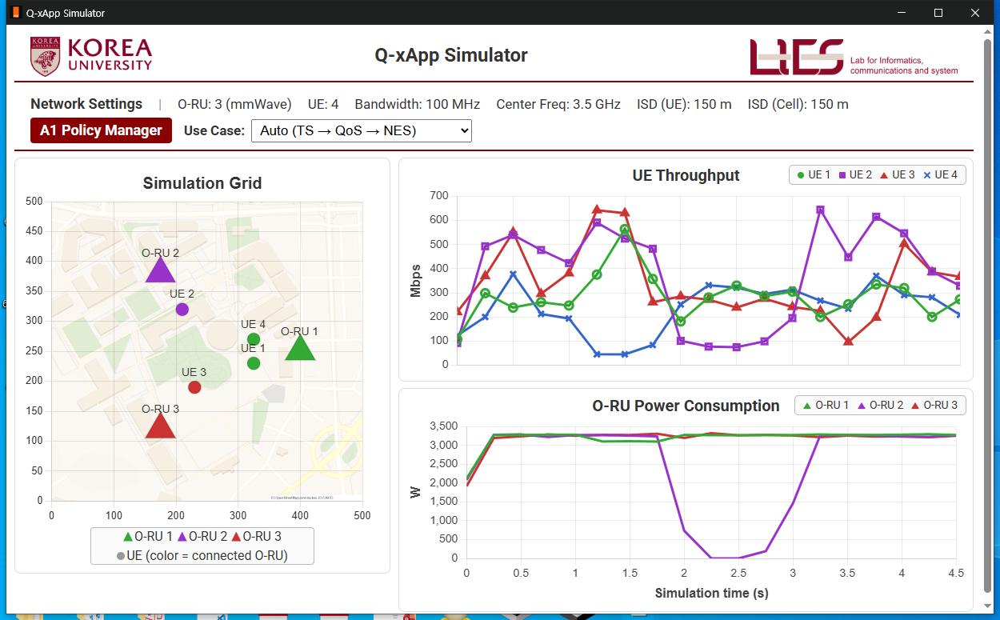
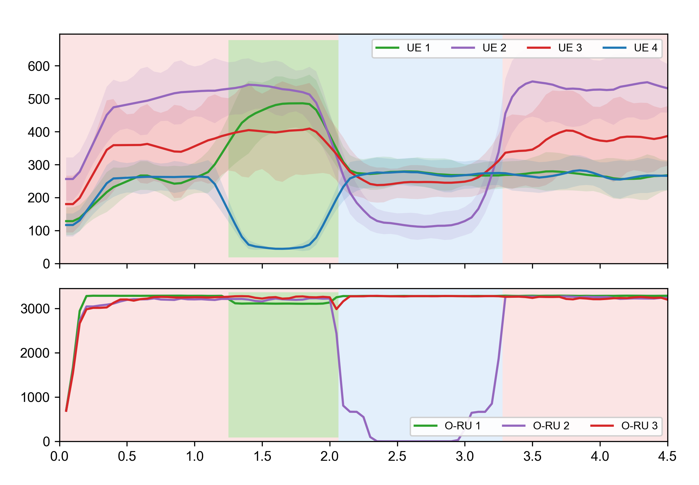

# Q-xApp: Quantum-Inspired xApp Framework for O-RAN Near-RT Control

A quantum-inspired xApp framework for near-real-time control in O-RAN networks. Supports three use cases through a unified assignment optimization engine. Runs on **ns-O-RAN + FlexRIC** with a real-time Docker-based GUI.

---

## 1. What is Q-xApp?

Q-xApp demonstrates that diverse O-RAN near-RT RIC use cases share a common **inter-entity assignment** structure. A single xApp handles multiple use cases by switching the assignment algorithm while keeping the same E2 interface pipeline.

**Three use cases, one xApp:**

| Use Case | Assignment Type | What it does |
|----------|----------------|-------------|
| **Traffic Steering (TS)** | UE ↔ Cell | Assigns UEs to best-SINR cells |
| **Network Energy Saving (NES)** | UE ↔ Cell | Packs UEs into fewer cells, sleeps idle O-RUs |
| **QoS-based Resource Allocation (QoS-RA)** | UE ↔ DRB | Assigns DRBs by per-UE 5QI requirement |

Switch between them in real-time from the GUI — no restart needed.

---

## 2. Fig.4 Results

For this figure the xApp runs in **auto mode**, cycling through **TS → TS+QoS-RA → NES → TS** so all use cases appear in one figure; in the GUI an operator can also select each use case manually in real time. The GUI (left) shows one live run; the averaged plot (right) is the mean of **50 independent runs** (RngRun seeds 1–50) of `scenario-fig4-qxapp.cc`.

### GUI (one live run)



The GUI carries the axes and legends the averaged plot shares: **UE Throughput** (per-UE, Mbps) and **O-RU Power Consumption** (per-O-RU, W) over **simulation time (s)**, plus the Simulation Grid (O-RU triangles, UE circles colored by serving cell; a sleeping O-RU turns gray).

### 50-run average



**Control modes (left → right):**

- **TS** — UEs steered to best-SINR cells. The equidistant pair UE1 / UE4 gets comparable throughput (**254.5 / 261.0 Mbps**).
- **TS+QoS-RA** — DRB weights enforce 5QI priority: high-priority UE1 vs low-priority UE4 ≈ **8:1** (467.1 / 57.9 Mbps).
- **NES** — O-RU 2 is put to sleep (power → **0 W**). UE2 is displaced and its throughput drops **~72%** (503.0 → 140.3 Mbps).
- **TS** (resumed after NES) — O-RU 2 wakes (power back to ~3.3 kW) and UE2 returns to **~103.7%** of its first-TS level (521.6 Mbps).

Per-run phase means are in [`fig4_ppt/runs_summary_50run.csv`](fig4_ppt/runs_summary_50run.csv) and [`fig4_ppt/phase_stats_raw_50run.txt`](fig4_ppt/phase_stats_raw_50run.txt); the plotting script is [`fig4_ppt/qxapp_fig4_plot_ppt_v5.py`](fig4_ppt/qxapp_fig4_plot_ppt_v5.py).

---

## 3. Quantum Assignment Engine

All three use cases are computed by Grover-style quantum solvers with
constraint oracles and utility-weighted amplification:

| Use case | Solver | Problem | Qubits |
|----------|--------|---------|--------|
| TS | [`flexric/xApp/dqna_ts.py`](flexric/xApp/dqna_ts.py) | 4 UE × 3 cells | 15 |
| NES | [`flexric/xApp/dqna_42.py`](flexric/xApp/dqna_42.py) | 4 UE × 2 awake cells | 10 |
| QoS-RA | [`flexric/xApp/dqna_qos.py`](flexric/xApp/dqna_qos.py) | 2 UE × 4 DRBs per O-RU | 8 |

Constraints (per-cell UE caps, distinct DRBs) are enforced by a feasibility
oracle that gates the utility kickback; utilities use an exponential encoding
(sum-monotone for TS/NES, per-UE-normalized for QoS-RA with classical
re-scoring on the raw objective). Each solver returned the brute-force-optimal
score on its full offline validation suite — for QoS-RA including the
exhaustive {0,1,10}^8 input grid (6,561 cases) —
and the Fig.4 cycle runs end-to-end with all three quantum paths active and
zero fallbacks — see
[`docs/QUANTUM_VALIDATION.md`](docs/QUANTUM_VALIDATION.md). The classical
matchers remain only as automatic legacy fallbacks. Requires Python with
`qiskit` (validated with qiskit 1.2.4); the solver interpreter path is set
via `QXAPP_PY`.

---

## 4. Architecture

```
┌─────────────────────────────────────────────────────────────┐
│                    Docker GUI (localhost:8000)                │
│  ┌───────────┐  ┌────────────┐  ┌─────────────────────┐    │
│  │ Sim Grid  │  │ Throughput │  │ Cell Power          │    │
│  │ (Map+UE+  │  │  (Mbps)    │  │     (W)             │    │
│  │  O-RU)    │  │            │  │                     │    │
│  └───────────┘  └────────────┘  └─────────────────────┘    │
│  Network Settings: 3 O-RU, 4 UE, 100MHz, ISD 150m          │
│  A1 Policy Manager: [Use Case ▼] [Sleep O-RU / 5QI]        │
│                         InfluxDB                             │
└──────────────────────────┬──────────────────────────────────┘
                           │
┌──────────────────────────┴──────────────────────────────────┐
│                    FlexRIC nearRT-RIC                         │
│              ┌────────────┐  ┌───────────────┐               │
│              │  KPM SM    │  │    RC SM       │               │
│              └──────┬─────┘  └───────┬───────┘               │
└─────────────────────┼────────────────┼──────────────────────┘
        SINR reports  │                │ Control commands
┌─────────────────────┴────────────────┴──────────────────────┐
│              ns-3 mmWave Simulation                           │
│   O-RU 1 (Cell 2)   O-RU 2 (Cell 3)   O-RU 3 (Cell 4)     │
│        UE 1    UE 2    UE 3    UE 4    LTE (anchor)         │
└──────────────────────────┬──────────────────────────────────┘
                           ▼
┌─────────────────────────────────────────────────────────────┐
│           Q-xApp Unified Controller (Fig. 2 Pipeline)        │
│                                                               │
│   Stage 1              Stage 2              Stage 3          │
│  ┌───────────────┐  ┌────────────────┐  ┌────────────────┐  │
│  │ Use-Case      │  │ Assignment     │  │ Output         │  │
│  │ Encoder       │→│ Algorithm      │→│ Interpreter    │  │
│  │               │  │                │  │                │  │
│  │ Read SINR,    │  │ TS: best-SINR  │  │ Handover       │  │
│  │ A1 policy,    │  │ NES: energy    │  │ Sleep/Wake     │  │
│  │ QoS config    │  │ QoS-RA: DRB    │  │ DRB weight     │  │
│  └───────────────┘  └────────────────┘  └────────────────┘  │
└─────────────────────────────────────────────────────────────┘
```

---

## 5. Prerequisites

| Component | Repository | Branch |
|-----------|-----------|--------|
| **ns-O-RAN** | https://github.com/Orange-OpenSource/ns-O-RAN-flexric | `main` |
| **FlexRIC** | https://gitlab.eurecom.fr/mosaic5g/flexric | `oie-ric-taap-xapps` |
| **Docker** | Docker + Docker Compose | — |

Install ns-O-RAN and FlexRIC following their respective guides first. Tested on **Ubuntu 24.04 (WSL2)**.

---

## 6. Installation

After the base platform is installed, apply Q-xApp modifications:

```bash
# 1. Copy ns-3 files
cp ns3/scenario-fig4-qxapp.cc                          <ns-O-RAN>/scratch/   # Fig.4 scenario
cp ns3/scenario/scenario-zero-with_parallel_loging.cc  <ns-O-RAN>/scratch/   # GUI demo scenario
cp ns3/mmwave-enb-net-device.cc                        <ns-O-RAN>/src/mmwave/model/
cp ns3/mmwave-flex-tti-pf-mac-scheduler.cc             <ns-O-RAN>/src/mmwave/model/
cp ns3/mmwave-flex-tti-pf-mac-scheduler.h              <ns-O-RAN>/src/mmwave/model/

# 2. Copy xApp files
cp flexric/xApp/qxapp_common.h      <FlexRIC>/examples/xApp/c/ctrl/
cp flexric/xApp/qxapp_unified.c     <FlexRIC>/examples/xApp/c/ctrl/
cp flexric/xApp/qxapp_*.c           <FlexRIC>/examples/xApp/c/ctrl/
cp flexric/xApp/dqna_ts.py          <FlexRIC>/examples/xApp/c/ctrl/   # quantum TS solver

# 3. Add build target to <FlexRIC>/examples/xApp/c/ctrl/CMakeLists.txt:
#    add_executable(xapp_qxapp_unified qxapp_unified.c)
#    target_link_libraries(xapp_qxapp_unified PRIVATE e42_xapp pthread sctp dl m)

# 4. Copy GUI
cp -r gui/* <ns-O-RAN>/GUI/

# 5. Build everything
cd <ns-O-RAN> && ./ns3 build
sudo bash -c 'cd <FlexRIC>/build && cmake .. && cmake --build . --target xapp_qxapp_unified -j$(nproc)'
cd <ns-O-RAN>/GUI && sudo docker compose up -d
```

### What Each Modified File Does

| File | Copies to | What was changed |
|------|----------|-----------------|
| `scenario-fig4-qxapp.cc` | `scratch/` | Fig.4 scenario: 3 O-RU, 4 UE, automated phases (TS → TS+QoS-RA → NES → TS), 7 s, energy model |
| `scenario-zero-with_parallel_loging.cc` | `scratch/` | GUI interactive demo: 3 O-RU, 4 UE, long-run, real-time use-case switching |
| `mmwave-enb-net-device.cc` | `src/mmwave/model/` | Added Energy_state sleep/wake + Radio_Bearer_Control handler |
| `mmwave-flex-tti-pf-mac-scheduler.cc/.h` | `src/mmwave/model/` | Added per-UE scheduling weight for QoS-RA |
| `qxapp_unified.c` | `examples/xApp/c/ctrl/` | Unified xApp: 3 use cases with Fig. 2 pipeline |
| `qxapp_common.h` | `examples/xApp/c/ctrl/` | Shared code: RC messages, CSV parsing, rate computation |
| `GUI/*` | `GUI/` | Web dashboard, Docker config, auto-start data pusher |

---

## 7. Running the Simulation

Open **three terminals** and run in order:

```bash
# Terminal 1: Start the nearRT-RIC
sudo <FlexRIC>/build/examples/ric/nearRT-RIC

# Terminal 2: Start ns-3 network simulation (wait for E2 Setup to complete)
#   GUI interactive demo:
cd <ns-O-RAN> && ./ns3 run "scratch/scenario-zero-with_parallel_loging --N_MmWaveEnbNodes=3 --N_Ues=4"
#   or the Fig.4 automated scenario:
#   ./ns3 run "scratch/scenario-fig4-qxapp --N_MmWaveEnbNodes=3 --N_Ues=4 --simTime=7"

# Terminal 3: Start Q-xApp controller (after ns-3 connects to RIC)
sudo <FlexRIC>/build/examples/xApp/c/ctrl/xapp_qxapp_unified
```

Then open **http://localhost:8000** in your browser. The Docker GUI and data pusher start automatically.

Switch use cases from the GUI at any time. The default mode is Traffic Steering.

---

## 8. Using the GUI

### Network Settings (top bar)
Fixed simulation parameters: O-RU count, UE count, bandwidth, center frequency, inter-site distance.

### A1 Policy Manager (second bar)
Switch use cases and configure policies in real-time:
- **TS mode**: "Max UE/Cell" selector
- **NES mode**: "Sleep O-RU" radio buttons — choose which O-RU to put to sleep
- **QoS-RA mode**: Per-UE 5QI selector (2, 4, 7, 9 — each unique)

### Charts
| Chart | What it shows |
|-------|--------------|
| **Simulation Grid** | Campus map with O-RU (triangles, colored) and UE (circles, colored by serving cell). Sleeping O-RUs turn gray. |
| **Throughput** | Per-UE throughput in Mbps over time |
| **Cell Power** | Per-cell energy consumption in Watts (sleep cells drop to zero) |

---

## 9. Technical Details

### Use Case Details

**Traffic Steering (TS)**
- Assignment: UE ↔ Cell (inter-cell), max 2 UEs per cell (A1 policy)
- Objective: Maximize total Shannon capacity `C = Σ log₂(1 + SINR)`
- RC Control: Connected_Mode_Mobility (style=3) — handover

**Network Energy Saving (NES)**
- Assignment: UE ↔ Cell (inter-cell), concentrate on fewest cells
- Objective: Minimize active cells while maintaining connectivity
- RC Control: style=3 (handover) + Energy_state (style=300, sleep/wake)

**QoS-based Resource Allocation (QoS-RA)**
- Assignment: UE ↔ DRB (per-UE 5QI requirement)
- Each UE has a 5QI requirement (2, 4, 7, 9). Each cell offers a subset of DRBs
- DRB Pool: DRB 1 (5QI=2, w=4.0), DRB 2 (5QI=4, w=3.0), DRB 3 (5QI=7, w=2.0), DRB 4 (5QI=9, w=1.0)
- Cell DRB availability: O-RU 1 → DRB 1,2,3 / O-RU 2 → DRB 2,3,4 / O-RU 3 → DRB 1,3,4
- Utility: 5QI match score × DRB weight × SINR
- RC Control: style=3 (handover) + Radio_Bearer_Control (style=1, scheduler weight)

### E2 Connection and Control Loop

The simulation platform integrates [FlexRIC](https://gitlab.eurecom.fr/mosaic5g/flexric) and [ns-O-RAN](https://github.com/Orange-OpenSource/ns-O-RAN-flexric) to realize a complete O-RAN near-RT control loop.

1. **E2 Setup**: ns-O-RAN establishes an SCTP connection with the nearRT-RIC (E2AP v1.01). Each mmWave gNB registers KPM and RC service models.
2. **E42 Interface**: The RIC connects to the Q-xApp via E42, a FlexRIC-specific interface for RIC–xApp communication.
3. **Subscription**: Q-xApp subscribes to KPM reports. ns-O-RAN begins periodically sending measurements.
4. **Control Loop**: Q-xApp periodically reads SINR → computes assignment → sends RC Control → receives ACK.

```
ns-O-RAN (E2 Node)          nearRT-RIC (FlexRIC)          Q-xApp
      │                            │                          │
      │──── E2 Setup Req/Resp ────→│                          │
      │                            │←── E42 Connect ──────────│
      │                            │←── RIC Subscription ─────│
      │                            │                          │
      │  ┌─── Control Loop ────────────────────────────────┐  │
      │──┼── RIC INDICATION ──────→│──── KPM Report ──────→│  │
      │  │  (SINR, PRB, position)  │                        │  │
      │  │                         │   [Encoder→Algo→Interp]│  │
      │  │                         │←── RIC CONTROL REQ ────│  │
      │←─┼── RIC CONTROL REQ ─────│    (E2SM-RC)           │  │
      │──┼── RIC CONTROL ACK ────→│──── CONTROL ACK ──────→│  │
      │  └──────────────────────────────────────────────────┘  │
```

### E2SM Service Models

| Service Model | Version | Function ID | Purpose |
|--------------|---------|-------------|---------|
| **E2SM-KPM** | v3.00 | 2 | Reports: SINR, neighbor SINR, PRB usage, throughput, RETX, UE position |
| **E2SM-RC** | v1.03 | 3 | Control: handover, cell sleep/wake, DRB weight |

### RC Control Styles

| Style | ID | What it controls | Used by |
|-------|-----|-----------------|---------|
| Radio_Bearer_Control | 1 | Per-UE scheduler weight (DRB priority) | QoS-RA |
| Connected_Mode_Mobility | 3 | UE handover between cells | TS, NES, QoS-RA |
| Energy_state | 300 | Cell sleep (TxPower=0) / wake (TxPower=30) | NES |

### Data Files

| File | Written by | Read by | Content |
|------|-----------|---------|---------|
| `ue_position.txt` | ns-3 | Data pusher → InfluxDB | UE positions, serving cell |
| `gnbs.txt` | ns-3 | Data pusher → InfluxDB | Cell positions, energy state |
| `cu-cp-cell-{2,3,4}.txt` | ns-3 | Data pusher + Q-xApp | Per-UE SINR |
| `energyfilecell{2,3,4}.csv` | ns-3 | Q-xApp | Cell energy consumption |
| `qxapp_result.json` | Q-xApp | GUI | Assignment, DRB, energy, mode |
| `xapp_mode.txt` | GUI | Q-xApp | Current use case (ts/nes/qos) |
| `xapp_sleep_config.txt` | GUI | Q-xApp | Which O-RU to sleep |
| `xapp_qos_config.txt` | GUI | Q-xApp | Per-UE 5QI values (e.g. 2,4,7,9) |

---

## 10. Project Structure

```
Q-xApp/
├── flexric/xApp/
│   ├── qxapp_common.h              # Shared: RC SM messages, CSV parsing, SINR/rate
│   ├── qxapp_unified.c             # Unified xApp: TS + NES + QoS-RA (Fig. 2 pipeline)
│   ├── qxapp_greedy_handover.c     # Standalone TS xApp
│   └── qxapp_energy_saving.c       # Standalone NES xApp
├── ns3/
│   ├── scenario-fig4-qxapp.cc      # Fig.4 scenario (3 O-RU, 4 UE, 7s, automated 4-phase)
│   ├── scenario/scenario-zero-with_parallel_loging.cc   # GUI interactive demo scenario
│   ├── mmwave-enb-net-device.cc
│   ├── mmwave-flex-tti-pf-mac-scheduler.cc
│   └── mmwave-flex-tti-pf-mac-scheduler.h
├── fig4_ppt/                       # Fig.4 results (50-run average)
│   ├── fig4_gui_capture.png        # GUI screenshot (one live run, labeled axes)
│   ├── fig4_50run_combined.png     # the averaged figure (also .pdf for high-res / paper)
│   ├── qxapp_fig4_plot_ppt_v5.py   # plotting script (x-axis 4.5s, marker from scheduler_weights.csv)
│   ├── runs_summary_50run.csv      # per-run phase means (seeds 1–50)
│   ├── phase_stats_raw_50run.txt   # aggregate phase means ± std
│   └── SHA256SUMS_50run.txt        # checksums of the public Fig.4 files
├── gui/
│   ├── main.py                           # FastAPI entrypoint
│   ├── requirements.txt
│   ├── configuration.env
│   ├── docker-compose.yml
│   ├── Dockerfile
│   ├── start.sh
│   ├── templates/chart.html              # Dashboard template
│   ├── static/univmap.png
│   └── src/
│       ├── http/data_controller.py       # API routes
│       ├── copy_sim_data_pusher.py       # InfluxDB data pusher
│       └── simulation_objects/           # Simulation state management
├── bs_ue_matching.py               # Quantum circuit (Qiskit) — future quantum assignment integration
└── README.md
```


---

## 11. References

- O-RAN Alliance, "O-RAN Architecture Description", O-RAN.WG1.O-RAN-Architecture-Description
- O-RAN WG3, "Use Cases and Requirements", O-RAN.WG3.TS.UCR-R004-v09.00
- Orange-OpenSource ns-O-RAN: https://github.com/Orange-OpenSource/ns-O-RAN-flexric
- FlexRIC: https://gitlab.eurecom.fr/mosaic5g/flexric

## License

This project builds upon ns-O-RAN and FlexRIC which are licensed under GPL-2.0 and Apache-2.0 respectively.
