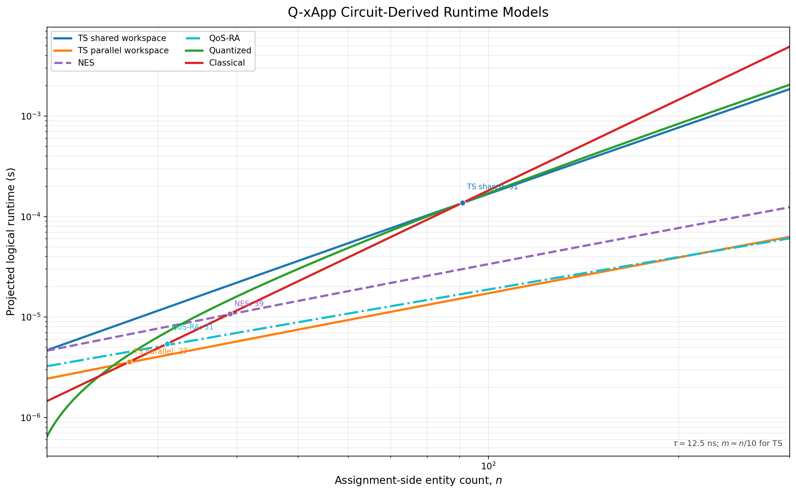

# 10. Complexity

This section derives the runtime curves of the Q-xApp circuits implemented in `dqna_ts.py`, `dqna_42.py`, and `dqna_qos.py`. The runtime equations are presented first, followed by the gate-count derivation of every term. The quantized and classical curves are retained as external comparison baselines.

## 10.1 Circuit-derived runtime curves

Let $n$ denote the number of entities being assigned, $m$ the number of candidate O-RUs, $q=\lceil\log_2m\rceil$ the address width, and $w=\lceil\log_2(n+1)\rceil$ the counter width. The UE-to-O-RU plot follows $m\simeq n/10$. All logarithms are base 2.

The quantum curves use a logical gate-layer time of $\tau=12.5\,\mathrm{ns}$. They describe scheduled logical circuits rather than Aer statevector wall time.

### Traffic steering with the shared counter workspace

`dqna_ts.py` reuses the same counting workspace across O-RUs. Its smoothed depth model is

$$
D_{\mathrm{TS,shared}}(n)
=\frac{n^2}{5}\log_2n
+\frac{n}{5}\log_2n
+\frac{n}{5}
+\log_2\!\left(n\log_2\frac{n}{10}\right)
+3.
$$

The corresponding runtime curve is

$$
t_{\mathrm{TS,shared}}(n)
=12.5D_{\mathrm{TS,shared}}(n)\ \mathrm{ns}.
$$

Its dominant term is $2.5n^2\log_2n\,\mathrm{ns}$.

### Traffic steering with parallel O-RU workspaces

Allocating an independent count workspace to each O-RU removes the factor $m$ from the counter depth. The resulting curve is

$$
D_{\mathrm{TS,parallel}}(n)
=2n\log_2n
+2\log_2n
+2\log_2\frac{n}{10}
+\frac{n}{5}
+\log_2\!\left(n\log_2\frac{n}{10}\right)
+3,
$$

$$
t_{\mathrm{TS,parallel}}(n)
=12.5D_{\mathrm{TS,parallel}}(n)\ \mathrm{ns}.
$$

Its dominant term is $25n\log_2n\,\mathrm{ns}$.

### Network energy saving

`dqna_42.py` uses one assignment bit per UE and one shared population counter. The feasibility flag is constructed and cleared around the utility marking block. The resulting curve is

$$
D_{\mathrm{NES}}(n)
=4n\log_2n+4\log_2n+7,
$$

$$
t_{\mathrm{NES}}(n)
=12.5D_{\mathrm{NES}}(n)\ \mathrm{ns}.
$$

Its dominant term is $50n\log_2n\,\mathrm{ns}$.

### QoS-based resource allocation

`dqna_qos.py` compares two $q$-bit DRB addresses and applies address-controlled utility rotations. Here $n$ denotes the number of candidate DRBs. With balanced multi-control synthesis, the controlled-rotation depth grows with $1+\log_2\log_2n$. The curve is

$$
D_{\mathrm{QoS}}(n)
=4n\left(1+\log_2\log_2n\right)
+3\log_2\log_2n
+4,
$$

$$
t_{\mathrm{QoS}}(n)
=12.5D_{\mathrm{QoS}}(n)\ \mathrm{ns}.
$$

Its dominant term is $50n\log_2\log_2n\,\mathrm{ns}$.

### Comparison baselines

The quantized curve is retained as the CQF comparison fit:

$$
t_{\mathrm{quant}}(n)
=9.98n^2\log_2\!\left(\log_2\frac{n}{10}\right)
-27.4n+1196\ \mathrm{ns}.
$$

The external classical Hungarian fit is also retained:

$$
t_{\mathrm{class}}(n)=0.182n^3\ \mathrm{ns}.
$$

The intersections with the classical reference curve are:

| Q-xApp curve | First integer crossover | Dominant growth |
|---|---:|---:|
| TS, parallel O-RU workspaces | $n=27$ | $O(n\log n)$ |
| QoS-RA | $n=31$ | $O(n\log\log n)$ |
| NES | $n=39$ | $O(n\log n)$ |
| TS, shared counter workspace | $n=91$ | $O(n^2\log n)$ under $m\simeq n/10$ |

Thus, the approximately 20--30-entity crossover is recovered for the parallel TS organization and occurs at 31 candidate DRBs for QoS-RA. It does not apply to the shared-workspace TS circuit, because that circuit serializes the O-RU-local count operations.

## 10.2 Clifford+T accounting model

The derivation follows the relative-phase Toffoli model used in CQF. A relative-phase Toffoli contributes four T gates and one T-depth layer. Clifford gates, including address-pattern $X$ wrapping and the XOR network in the QoS circuit, are reported separately and do not enter the T-depth runtime curve.

Let:

- $N$: number of UEs or source entities;
- $M$: number of O-RUs or destination entities;
- $R$: number of candidate DRBs in the QoS circuit;
- $k=\lceil\log_2M\rceil$: O-RU address width;
- $q=\lceil\log_2R\rceil$: DRB address width;
- $w=\lceil\log_2(N+1)\rceil$: population-counter width;
- $d$: violation-aggregate width;
- $C_r$ and $\Delta_r$: T-count and T-depth of an $r$-controlled $X$;
- $\rho_r(\epsilon)$ and $\gamma_r(\epsilon)$: T-count and T-depth of an $r$-address-controlled numerical $R_y$ at precision $\epsilon$;
- $\tau$: logical quantum cycle time.

With a clean balanced tree, an $r$-control conjunction can be represented by approximately $2r-3$ relative-phase Toffolis, giving

$$
C_r\simeq4(2r-3),
$$

$$
\Delta_r\simeq2\lceil\log_2r\rceil.
$$

The numerical curves keep the precision-dependent rotation cost explicit. Their address-control component is approximated by

$$
\gamma_r(\epsilon)
\simeq1+\lceil\log_2r\rceil+\gamma_{R_y}(\epsilon).
$$

### Address equality flag

Testing whether a $k$-bit selection register equals one destination address uses a $k$-input AND. Constructing and cleaning the flag requires $2(k-1)$ relative-phase Toffolis:

$$
T_{\mathrm{eq}}(k)=8(k-1),
$$

$$
D_{\mathrm{eq}}(k)=2\lceil\log_2k\rceil.
$$

The Qiskit source expresses the same control directly through pattern wrapping followed by MCX gates. Exposing it as an equality flag makes the T-count and possible parallel schedule explicit without changing the Boolean operation.

### Controlled counter update

A flag-controlled ripple increment of a $w$-bit population counter contains approximately $2w-1$ relative-phase Toffolis:

$$
T_{+1}(w)=4(2w-1)=8w-4,
$$

$$
D_{+1}(w)=2w-1.
$$

The counter must be cleaned after the constraint result has been transferred to the violation or feasibility register. For a controlled increment together with its inverse, define

$$
I_T(w)=2T_{+1}(w)=16w-8,
$$

$$
I_D(w)=2D_{+1}(w)=4w-2.
$$

The plotted logical schedule uses relative-phase cancellation between the forward and inverse ripple networks and therefore uses the effective depth

$$
\bar I_D(w)\simeq2w.
$$

This replacement affects the constant factor, not the gate count or asymptotic order.

### Capacity comparison and global mark

A reversible comparison between a $w$-bit counter and a classical capacity threshold uses approximately $w$ Toffolis in each direction:

$$
T_{\mathrm{cmp}}(w)=8w,
$$

$$
D_{\mathrm{cmp}}(w)=2w.
$$

Combining $M$ per-O-RU feasibility bits into one mark with a balanced AND tree gives

$$
T_{\mathrm{AND}}(M)=8(M-1),
$$

$$
D_{\mathrm{AND}}(M)=2\lceil\log_2M\rceil.
$$

### Assignment-register reflection

The address register contains $Nk$ qubits for UE-to-O-RU assignment. Its reflection is implemented by $X/H$ wrapping and one multi-controlled operation:

$$
T_{\mathrm{ref}}=c_{\mathrm{ref}}Nk,
$$

$$
D_{\mathrm{ref}}=\lceil\log_2(Nk)\rceil.
$$

The coefficient $c_{\mathrm{ref}}$ depends on the clean-ancilla MCX synthesis. It is kept symbolic in T-count and explicit as a tree depth in the runtime model.

## 10.3 Traffic-steering circuit (`dqna_ts.py`)

The analyzed TS path is the combined feasibility-and-utility circuit implemented by `append_gated_oracle()` and `gated_diffuser()` in `dqna_modes.py`, which is dispatched from `dqna_ts.py`. The circuit prepares the UE address registers, computes the capacity constraint, applies the address-controlled utility rotations, marks the joint zero state of the violation and cost registers, cleans all workspaces, and reflects the assignment register.

### Qubit count

The assignment register uses $Nk$ qubits. The current shared-workspace circuit reuses the larger of the $N$ utility qubits and the $w$-bit count register. It also requires a $d$-bit violation aggregate, one phase target, and one clean MCX-synthesis ancilla:

$$
Q_{\mathrm{TS,shared}}
=Nk+\max(N,w)+d+2.
$$

For the implemented $N=4$, $M=3$ circuit, $k=2$, $w=3$, and $d=3$, so

$$
Q_{\mathrm{TS,shared}}=8+4+3+2=17.
$$

The parallel O-RU organization assigns a separate $w$-bit counter and lane-enable qubit to each O-RU:

$$
Q_{\mathrm{TS,parallel}}
=Nk+Mw+N+d+M+2.
$$

The parallel form spends $Mw+M$ additional workspace qubits to remove the factor $M$ from the counter depth.

### A) UE--O-RU equality controls

Every UE address is tested against every O-RU address. Across all $NM$ pairs,

$$
T_{\mathrm{TS,flag}}
=NM\,T_{\mathrm{eq}}(k)
=8NM(k-1).
$$

With the shared workspace, the pair controls are scheduled serially:

$$
D_{\mathrm{TS,flag}}^{\mathrm{shared}}
=2NM\lceil\log_2k\rceil.
$$

With one lane per O-RU, all O-RU address tests for the same UE can be scheduled together:

$$
D_{\mathrm{TS,flag}}^{\mathrm{parallel}}
=2N\lceil\log_2k\rceil.
$$

### B) Population counters

The selected O-RU counter is updated for each UE and is later cleaned. The T-count is unaffected by scheduling:

$$
T_{\mathrm{TS,count}}
=NM I_T(w)
=8NM(2w-1).
$$

The current counter is reused across O-RUs, so its conservative depth is

$$
D_{\mathrm{TS,count}}^{\mathrm{shared}}
=NM I_D(w).
$$

Using the effective scheduled ripple depth gives

$$
\bar D_{\mathrm{TS,count}}^{\mathrm{shared}}
\simeq2NMw.
$$

With $M$ independent counters, O-RU-local updates occur in parallel and only the UE dimension remains serial:

$$
D_{\mathrm{TS,count}}^{\mathrm{parallel}}
=N I_D(w),
$$

$$
\bar D_{\mathrm{TS,count}}^{\mathrm{parallel}}
\simeq2Nw.
$$

This is the term that separates the $O(N^2\log N)$ shared-workspace curve from the $O(N\log N)$ parallel curve under $M\simeq N/10$.

### C) Capacity comparison and constraint aggregation

Each O-RU counter is compared with its capacity $U_a$. The comparator is computed and cleaned, after which the $M$ results are combined:

$$
T_{\mathrm{TS,limit}}
=MT_{\mathrm{cmp}}(w)+T_{\mathrm{AND}}(M),
$$

$$
T_{\mathrm{TS,limit}}
=8Mw+8(M-1).
$$

For the shared workspace,

$$
D_{\mathrm{TS,limit}}^{\mathrm{shared}}
=2Mw+2\lceil\log_2M\rceil.
$$

For parallel O-RU counters,

$$
D_{\mathrm{TS,limit}}^{\mathrm{parallel}}
=2w+2\lceil\log_2M\rceil.
$$

### D) Utility-controlled rotations

There is one address-controlled utility rotation for each UE--O-RU pair. The inverse utility block cleans the cost register after the joint mark:

$$
T_{\mathrm{TS,utility}}
=2NM\rho_k(\epsilon).
$$

Different UEs have distinct cost qubits and can be scheduled together. The $M$ address alternatives of one UE remain ordered on the same target:

$$
D_{\mathrm{TS,utility}}
=2M\gamma_k(\epsilon).
$$

Data-dependent zero-angle rotations are identities and reduce the realized count, but the worst-case expression retains all $NM$ utility entries.

### E) Joint feasibility-and-utility mark

The code marks the state in which the $d$ violation qubits and all $N$ cost qubits are zero. The X wrappers are Clifford gates; the non-Clifford cost is

$$
T_{\mathrm{TS,joint}}=C_{d+N},
$$

$$
D_{\mathrm{TS,joint}}=\Delta_{d+N}.
$$

### F) Assignment reflection

The reflection over the $Nk$ assignment qubits contributes

$$
T_{\mathrm{TS,ref}}=c_{\mathrm{ref}}Nk,
$$

$$
D_{\mathrm{TS,ref}}=\lceil\log_2(Nk)\rceil.
$$

### G) Complete TS T-count

Adding the blocks without asymptotic compression gives

$$
T_{\mathrm{TS}}
=8NM(k-1)
+8NM(2w-1)
+8Mw
+8(M-1)
+2NM\rho_k(\epsilon)
+C_{d+N}
+c_{\mathrm{ref}}Nk.
$$

The terms correspond respectively to address equality, count update and cleanup, per-O-RU comparison, constraint aggregation, utility encoding and cleanup, the joint mark, and assignment reflection.

### H) Complete TS T-depth

The shared-workspace depth is

$$
D_{\mathrm{TS}}^{\mathrm{shared}}
=2NM\lceil\log_2k\rceil
+NM I_D(w)
+2Mw
+2\lceil\log_2M\rceil
+2M\gamma_k(\epsilon)
+\Delta_{d+N}
+\lceil\log_2(Nk)\rceil.
$$

The parallel O-RU depth is

$$
D_{\mathrm{TS}}^{\mathrm{parallel}}
=2N\lceil\log_2k\rceil
+N I_D(w)
+2w
+2\lceil\log_2M\rceil
+2M\gamma_k(\epsilon)
+\Delta_{d+N}
+\lceil\log_2(Nk)\rceil.
$$

For the plotted logical schedule, the lower-order equality-control and synthesis constants are absorbed into the fitted offset. Applying $\bar I_D(w)\simeq2w$ gives

$$
\widetilde D_{\mathrm{TS}}^{\mathrm{shared}}
=2NMw+2Mw+2M+\lceil\log_2(Nk)\rceil+3,
$$

$$
\widetilde D_{\mathrm{TS}}^{\mathrm{parallel}}
=2Nw+2w+2\lceil\log_2M\rceil+2M
+\lceil\log_2(Nk)\rceil+3.
$$

Substituting $M\simeq N/10$, $k\simeq\log_2(N/10)$, and $w\simeq\log_2N$ yields exactly the two TS runtime equations at the beginning of this section.

### I) Fixed implementation check

The repository resource report for the implemented $4\times3$ gated TS circuit gives:

| Quantity | Recorded value |
|---|---:|
| Logical qubits | 17 |
| Logical depth after one-level decomposition | 873 |
| `rz/sx/x/cx` depth after transpilation | 9,111 |
| CX gates | 5,366 |
| Total transpiled gates | 13,283 |

The transpiled profile validates the relative ordering of the circuit blocks but is not used as a QPU latency curve; arbitrary rotations are still ideal numerical gates in that profile.

## 10.4 Network-energy-saving circuit (`dqna_42.py`)

The NES circuit represents two awake O-RUs with one assignment qubit per UE. The number of UEs assigned to cell 1 is stored in a population counter, while $N$ minus that count gives the population of cell 0. A feasibility flag gates the utility mark, and the auxiliary count register is reused as the utility-cost register.

### Qubit count

The assignment register uses $N$ qubits. The shared auxiliary workspace must accommodate the larger of the $w$-bit counter and the $N$ utility qubits, followed by the phase target and feasibility flag:

$$
Q_{\mathrm{NES}}
=N+\max(N,w)+2.
$$

For $N=4$ and $w=3$, the implementation uses 10 qubits.

### A) Population-count construction

`_flag_feasible()` computes and cleans the population counter. The same block appears when the feasibility flag is cleared after utility marking. Therefore the count-update T-count is

$$
T_{\mathrm{NES,count}}
=2N I_T(w),
$$

$$
T_{\mathrm{NES,count}}
=16N(2w-1).
$$

Its conservative and scheduled depths are

$$
D_{\mathrm{NES,count}}
=2N I_D(w),
$$

$$
\bar D_{\mathrm{NES,count}}
\simeq4Nw.
$$

### B) Allowed-count equality tests

Let

$$
\mathcal A
=\{c: c\le U,\ N-c\le U\}
$$

be the allowed cell-1 populations and let $A=|\mathcal A|$. Each value is tested with a $w$-controlled operation when the flag is formed and again when it is cleared:

$$
T_{\mathrm{NES,allowed}}
=2A C_w,
$$

$$
D_{\mathrm{NES,allowed}}
=2A\Delta_w.
$$

For the implemented $N=4$, $U=2$ case, $\mathcal A=\{2\}$ and $A=1$.

### C) Two-cell utility encoding

Each UE has two assignment alternatives. Forward and inverse utility blocks give four controlled rotations per UE:

$$
T_{\mathrm{NES,utility}}
=4N\rho_1(\epsilon).
$$

The UEs use different cost targets, so their rotations are parallel across UEs:

$$
D_{\mathrm{NES,utility}}
=4\gamma_1(\epsilon).
$$

### D) Joint mark and reflection

The mark is controlled by the feasibility flag and the $N$ cost qubits:

$$
T_{\mathrm{NES,joint}}=C_{N+1},
$$

$$
D_{\mathrm{NES,joint}}=\Delta_{N+1}.
$$

The $N$-qubit assignment reflection contributes

$$
T_{\mathrm{NES,ref}}=C_{N-1},
$$

$$
D_{\mathrm{NES,ref}}=\Delta_{N-1}.
$$

### E) Complete NES T-count and T-depth

The complete non-Clifford count is

$$
T_{\mathrm{NES}}
=2N I_T(w)
+2A C_w
+4N\rho_1(\epsilon)
+C_{N+1}
+C_{N-1}.
$$

The complete depth is

$$
D_{\mathrm{NES}}
=2N I_D(w)
+2A\Delta_w
+4\gamma_1(\epsilon)
+\Delta_{N+1}
+\Delta_{N-1}.
$$

Using $\bar I_D(w)\simeq2w$, $A=1$, and the balanced-tree approximations gives the plotted form

$$
\widetilde D_{\mathrm{NES}}
=4N\log_2N+4\log_2N+7.
$$

For the implemented $4\times2$ circuit, the source-level worst-case block counts are 48 counter MCX gates, two three-control allowed-count tests, up to 16 controlled utility rotations, one five-control joint mark, and one three-control assignment reflection. Zero-angle utility entries reduce the realized rotation count.

## 10.5 QoS-based resource-allocation circuit (`dqna_qos.py`)

The QoS circuit assigns one of $R$ DRBs to each of two UEs. Each UE uses a $q=\lceil\log_2R\rceil$-qubit address. An in-place XOR network detects whether the two addresses are equal, the resulting distinctness flag gates two per-UE utility cost qubits, and the assignment register is reflected after the workspaces are cleaned.

### Qubit count

The two DRB addresses use $2q$ qubits. The remaining qubits are the distinctness flag, two cost qubits, and the phase target:

$$
Q_{\mathrm{QoS}}=2q+4.
$$

For $R=4$, $q=2$ and the implementation uses eight qubits.

### A) DRB-distinctness flag

The XOR of corresponding address bits is computed in place on the second UE's address. The equality result is converted into a distinctness flag by one $q$-controlled operation, and the network is reversed after utility marking. The Clifford and non-Clifford counts are

$$
G_{\mathrm{QoS,XOR}}=4q\ \mathrm{CNOTs},
$$

$$
T_{\mathrm{QoS,distinct}}=2C_q,
$$

$$
D_{\mathrm{QoS,distinct}}=2\Delta_q.
$$

### B) DRB-address-controlled utility encoding

Each of the two UEs has $R$ utility values. The utility block and its inverse therefore contain

$$
T_{\mathrm{QoS,utility}}
=4R\rho_q(\epsilon).
$$

The two UE rows act on separate cost targets and can be parallelized. The $R$ address alternatives within a row remain ordered:

$$
D_{\mathrm{QoS,utility}}
=4R\gamma_q(\epsilon).
$$

### C) Joint mark and reflection

The phase target is controlled by the distinctness flag and the two zero-valued cost qubits:

$$
T_{\mathrm{QoS,joint}}=C_3,
$$

$$
D_{\mathrm{QoS,joint}}=\Delta_3.
$$

The assignment register has $2q$ qubits:

$$
T_{\mathrm{QoS,ref}}=C_{2q-1},
$$

$$
D_{\mathrm{QoS,ref}}=\Delta_{2q-1}.
$$

### D) Complete QoS T-count and T-depth

The complete non-Clifford count is

$$
T_{\mathrm{QoS}}
=2C_q
+4R\rho_q(\epsilon)
+C_3
+C_{2q-1}.
$$

Including the XOR network, the total logical gate count is

$$
G_{\mathrm{QoS}}
=4q
+2C_q
+4R\rho_q(\epsilon)
+C_3
+C_{2q-1}.
$$

The T-depth is

$$
D_{\mathrm{QoS}}
=2\Delta_q
+4R\gamma_q(\epsilon)
+\Delta_3
+\Delta_{2q-1}.
$$

With $q\simeq\log_2R$ and $\gamma_q(\epsilon)\simeq1+\log_2q$, the plotted depth becomes

$$
\widetilde D_{\mathrm{QoS}}
=4R\left(1+\log_2\log_2R\right)
+3\log_2\log_2R
+4.
$$

For the implemented two-UE, four-DRB circuit, the source-level worst case contains eight CNOTs in the distinctness network, two two-control flag operations, up to 16 controlled utility rotations, one three-control joint mark, and one three-control assignment reflection.

## 10.6 Quantized and classical comparisons

### One-hot quantized resource model

A one-hot formulation introduces one binary variable $x_{u,a}$ for every UE--O-RU pair and $w$ binary slack variables for each O-RU capacity constraint. Its qubit count is

$$
Q_{\mathrm{quant}}=NM+Mw.
$$

The one-destination constraint for each UE couples every pair of its $M$ variables:

$$
E_{\mathrm{onehot}}
=N\binom{M}{2}.
$$

For each O-RU, the capacity penalty couples its $N$ assignment variables and $w$ slack variables:

$$
E_{\mathrm{capacity}}
=M\binom{N+w}{2}.
$$

The dense worst-case number of quadratic interactions is therefore

$$
E_{ZZ}
=N\binom{M}{2}
+M\binom{N+w}{2}.
$$

If one synthesized $ZZ$ interaction has T-count $T_{ZZ}(\epsilon)$, the cost-Hamiltonian block has

$$
T_{\mathrm{quant}}
=E_{ZZ}T_{ZZ}(\epsilon)
+O(NM+Mw).
$$

Under all-to-all connectivity, edge coloring allows nonincident $ZZ$ interactions to run together. The ideal interaction depth is

$$
D_{\mathrm{quant}}
=O\!\left(\max\{M,N+w\}\right).
$$

Restricted connectivity adds routing and SWAP depth. The comparison curve retained from CQF abstracts this scheduling into the parallelism factor $s$:

$$
t_{\mathrm{quant,analytic}}(N)
=50\,\mathrm{ns}
\left[
\frac{N^2-N}{s}
\log_2\!\left(\log_2\frac{N}{10}\right)
\right],
$$

$$
s=5.
$$

The factor $N^2-N$ represents pairwise assignment-variable interactions, while $\log_2\log_2(N/10)$ represents the address-control depth. The empirical overlay at the beginning of this section retains the fitted form

$$
t_{\mathrm{quant}}(N)
=9.98N^2\log_2\!\left(\log_2\frac{N}{10}\right)
-27.4N+1196\ \mathrm{ns}.
$$

This baseline spends $O(NM)$ assignment qubits, whereas the Q-xApp address encoding spends $O(N\log M)$ assignment qubits.

### Classical Hungarian reference

The classical curve is

$$
t_{\mathrm{class}}(N)=\alpha N^3,
$$

$$
\alpha=0.182\ \mathrm{ns}.
$$

The coefficient was fitted on the external reference machine used by CQF. It is retained unchanged to compare the new Q-xApp circuit curves against the same classical reference and is not a measurement from the Q-xApp host.

## 10.7 Gate model to plotted runtime

The detailed T-count equations describe total non-Clifford work. The plotted runtime uses T-depth because gates acting on disjoint qubits can be scheduled together. For every Q-xApp curve,

$$
t(N)=\tau\widetilde D(N).
$$

The plotted cycle time is

$$
\tau=12.5\ \mathrm{ns}.
$$

The substitutions used in the graph are:

| Circuit | Natural plot variable | Depth substitution |
|---|---|---|
| TS shared | $n=N$, $M\simeq N/10$ | $2NMw+2Mw+2M+\lceil\log_2(Nk)\rceil+3$ |
| TS parallel | $n=N$, $M\simeq N/10$ | $2Nw+2w+2\lceil\log_2M\rceil+2M+\lceil\log_2(Nk)\rceil+3$ |
| NES | $n=N$ | $4Nw+4w+7$ |
| QoS-RA | $n=R$ | $4R(1+\log_2\log_2R)+3\log_2\log_2R+4$ |

Replacing the ceiling functions by their smooth logarithmic values gives the four formulas in Section 10.1. The intersections in the graph are calculated from these displayed formulas, not copied from the CQF proposed curve.

## 10.8 Interpretation

The new curves differ from CQF because they are tied to the three Q-xApp circuit structures:

- TS exposes the cost of reusing one count workspace across all O-RUs;
- NES has a larger $n\log n$ coefficient because its count-based feasibility flag is formed and cleared around utility marking;
- QoS replaces population counting with a DRB-address comparison and therefore scales as $n\log\log n$ in the DRB count;
- parallel O-RU count workspaces restore the early TS crossover by exchanging additional ancilla qubits for lower depth.

Aer timings remain a separate implementation measurement. Statevector simulation requires memory proportional to $2^Q$ and does not represent the logical QPU runtime plotted above.
