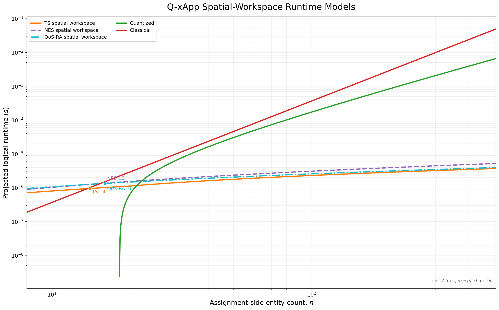

# 10. Complexity

This section derives the $n$-dependent runtime curves of spatial-workspace variants of the Q-xApp circuits in `dqna_ts.py`, `dqna_modes.py`, `dqna_42.py`, and `dqna_qos.py`. The source predicates and compute--mark--uncompute dependencies are retained; shared sequential workspaces are replaced by independent resource-local workspaces and balanced reversible reductions.

## 10.1 Circuit-derived runtime curves

Let $n$ denote the problem scale and

```math
h=\log_2 n.
```

For the analytical spatial-workspace circuits, a balanced reversible population tree is represented by

```math
P(n)=2h(h+1).
```

The quantum runtime is

```math
t_Q(n)=\tau D(n),
```

with

```math
\tau=12.5\,\mathrm{ns}.
```

Here, $\tau$ is an effective gate-layer latency used to convert circuit T-depth into nominal execution time. It is not a measured hardware or fault-tolerant logical-gate duration. Parallelization gains are represented in the circuit depth $D(n)$, not in $\tau$.

### Traffic steering

For TS, let

```math
m=\max\left(2,\frac{n}{10}\right),
\qquad
k=\log_2 m.
```

The spatial-workspace depth is

```math
\begin{aligned}
D_{\mathrm{TS}}(n)
={}&P(n)
+4\log_2 k
+2h+2k\\
&+2\log_2(m+n)
+2\log_2(nm)\\
&+2\log_2(nk-1)
+4.
\end{aligned}
```

Thus,

```math
D_{\mathrm{TS}}(n)=O(\log^2 n).
```

The corresponding runtime is

```math
t_{\mathrm{TS}}(n)
=12.5D_{\mathrm{TS}}(n)\ \mathrm{ns}.
```

### Network energy saving

The NES circuit uses the same population-tree primitive for its two-O-RU population constraint. Its depth is

```math
D_{\mathrm{NES}}(n)
=
2P(n)
+4\log_2 h
+2\log_2(n+1)
+2\log_2(n-1)
+4.
```

Hence,

```math
D_{\mathrm{NES}}(n)=O(\log^2 n),
```

and

```math
t_{\mathrm{NES}}(n)
=12.5D_{\mathrm{NES}}(n)\ \mathrm{ns}.
```

The factor $2P(n)$ conservatively includes construction and clearing of the population workspace around the feasibility-gated utility operation.

### QoS-based resource allocation

For QoS-RA, the number of UEs and candidate DRBs increase together:

```math
N_{\mathrm{UE}}=R_{\mathrm{DRB}}=n.
```

The spatial-workspace depth is

```math
D_{\mathrm{QoS}}(n)
=
P(n)
+4\log_2 h
+10h
+2\log_2(nh-1)
+6.
```

Therefore,

```math
D_{\mathrm{QoS}}(n)=O(\log^2 n),
```

with runtime

```math
t_{\mathrm{QoS}}(n)
=12.5D_{\mathrm{QoS}}(n)\ \mathrm{ns}.
```

### Comparison baselines

The quantized comparison curve is retained from CQF:

```math
t_{\mathrm{quant}}(n)
=
9.98n^2
\log_2\!\left(\log_2\frac{n}{10}\right)
-27.4n+1196
\ \mathrm{ns}.
```

For the bounded Hungarian reference, the common unit-demand formulation uses $n$ source rows, $n$ physical resource slots, and $n$ private dummy columns. Extending the CQF square-Hungarian coefficient to the resulting $n\times 2n$ rectangular assignment gives

```math
t_{\mathrm{class}}(n)
=
0.182n^2(2n)
=
0.364n^3
\ \mathrm{ns}.
```

The coefficient $0.364$ is an analytical rectangular normalization rather than a measured bounded-Hungarian latency.

The first intersections with the classical reference are:

| Q-xApp curve | First crossover | Dominant growth |
|---|---:|---:|
| TS | $n=14$ | $O(\log^2 n)$ |
| NES | $n=16$ | $O(\log^2 n)$ |
| QoS-RA | $n=16$ | $O(\log^2 n)$ |



These curves represent analytical T-depth under a qubit-rich spatial-workspace organization rather than measured execution time on currently available quantum processors.

## 10.2 Clifford+T accounting model

The derivation follows the relative-phase Toffoli model used in CQF. A relative-phase Toffoli contributes four T gates and one T-depth layer. Clifford gates are not included in the T-depth runtime curve.

Let:

- $N$: number of UEs or source entities;
- $M$: number of O-RUs;
- $R$: number of candidate DRBs;
- $k=\lceil\log_2M\rceil$: O-RU address width;
- $q=\lceil\log_2R\rceil$: DRB address width;
- $w=\lceil\log_2(N+1)\rceil$: population-counter width;
- $\tau$: effective gate-layer latency.

For an $r$-controlled operation, the balanced-tree depth is approximated by

```math
\Delta_r
\simeq
2\lceil\log_2r\rceil.
```

A $w$-bit reversible capacity comparison is represented by

```math
D_{\mathrm{cmp}}(w)\simeq 2w.
```

The balanced population tree used by the three spatial-workspace circuits has the smooth depth

```math
P(n)=2\log_2n\left(\log_2n+1\right).
```

This common primitive is the main source of the $O(\log^2 n)$ depth.

## 10.3 Traffic-steering circuit (`dqna_ts.py`, `dqna_modes.py`)

The TS model follows `append_gated_oracle()` and `gated_diffuser()` in `dqna_modes.py`, dispatched from `dqna_ts.py`. The shared counter in `UnitCountCapacityConstraint` is replaced by independent O-RU population workspaces; the capacity predicate, utility controls, joint mark, cleanup, and assignment reflection are retained.

Under the scaling regime

```math
M\simeq \frac{N}{10},
```

the resource-local population trees dominate the reduced depth. The remaining equality, capacity, utility, reduction, and assignment-reflection terms contribute only logarithmic factors. This gives the runtime expression in Section 10.1 and

```math
D_{\mathrm{TS}}=O(\log^2 N).
```

The lower depth is obtained by exchanging additional workspace qubits for spatial parallelism.

## 10.4 Network-energy-saving circuit (`dqna_42.py`)

In `dqna_42.py`, `quality_oracle()` calls `_flag_feasible()` before and after utility marking, and each call computes and clears the shared population counter. Replacing each counter pass with the same balanced population tree preserves the source multiplicity and gives the factor $2P(n)$:

```math
D_{\mathrm{NES}}=O(\log^2 N).
```

The resulting analytical crossover with the bounded Hungarian reference occurs at $N=16$.

## 10.5 QoS-based resource-allocation circuit (`dqna_qos.py`)

The fixed two-UE distinctness and utility structure in `dqna_qos.py` is generalized to $N=R=n$. Each DRB receives an independent occupancy and utility workspace; capacity one is checked with a population tree and the DRB-local results are reduced in parallel.

This gives

```math
D_{\mathrm{QoS}}=O(\log^2 n),
```

with the analytical crossover at $n=16$.

## 10.6 Quantized and classical comparisons

### One-hot quantized resource model

The quantized comparison is retained from CQF to provide the same external reference used in the earlier complexity analysis. It represents a one-hot assignment formulation with $O(NM)$ assignment variables and pairwise interaction costs.

Its retained empirical curve is

```math
t_{\mathrm{quant}}(N)
=
9.98N^2
\log_2\!\left(\log_2\frac{N}{10}\right)
-27.4N+1196
\ \mathrm{ns}.
```

### Classical bounded-Hungarian reference

For a common unit-demand comparison, the bounded Hungarian solver expands the assignment into $n$ source rows, $n$ physical resource slots, and $n$ private dummy columns. The resulting $n\times2n$ rectangular assignment is modeled as

```math
t_{\mathrm{class}}(n)
=
0.364n^3
\ \mathrm{ns}.
```

The coefficient is derived from the external CQF coefficient $0.182\,\mathrm{ns}$ using the rectangular work proxy $r^2c$. It is used as an analytical normalization and is not presented as an empirical measurement of the Q-xApp bounded-Hungarian implementation.

## 10.7 Gate model to plotted runtime

The plotted quantum runtime is obtained from

```math
t(n)=\tau D(n),
\qquad
\tau=12.5\,\mathrm{ns}.
```

The three curves use the same effective gate-layer latency. Their different runtimes arise only from their circuit depths.

| Circuit | Problem-scale convention | Depth scaling | Crossover |
|---|---|---:|---:|
| TS | $N=n,\ M\simeq n/10$ | $O(\log^2n)$ | 14 |
| NES | $N=n$ | $O(\log^2n)$ | 16 |
| QoS-RA | $N=R=n$ | $O(\log^2n)$ | 16 |

The crossover is not tied to a single exact value of $\tau$. A four-times slower $50\,\mathrm{ns}$ gate-layer assumption shifts the three crossover points to approximately 24, 27, and 27 while preserving the same scaling trend.

## 10.8 Interpretation

The three reduced Q-xApp curves use one common circuit-design principle: serial reuse of a shared workspace is replaced by spatially separated resource-local workspaces, followed by balanced reversible reduction.

This organization gives the three use cases the same $O(\log^2n)$ depth order while preserving their different assignment structures:

- TS uses O-RU-local population and capacity workspaces;
- NES uses a tree-structured population workspace;
- QoS-RA uses DRB-local population and utility workspaces.

The analytical reduction is a time-space tradeoff. It assumes sufficient logical qubits to expose the available parallelism and should therefore be interpreted as a circuit-level scalability model rather than a near-term hardware benchmark. Statevector wall-clock time and hardware-aware QPU latency projections remain separate implementation measurements.
