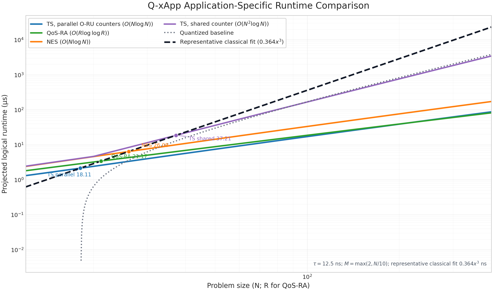

# 10. Complexity

This section derives the logical-resource and runtime complexity of the Q-xApp circuits implemented in `dqna_ts.py`, `dqna_42.py`, and `dqna_qos.py`. The derivation follows the actual oracle structure of each application: traffic steering (TS) performs UE--O-RU address tests and capacity counting, network energy saving (NES) forms and clears a two-cell population-feasibility flag, and QoS-based resource allocation (QoS-RA) compares two DRB addresses and applies DRB-controlled utility rotations. Because these circuits implement different predicates, they have different depth equations and asymptotic orders.

## 10.1 Model and notation

The natural scaling variable is application dependent.

| Circuit | Scaling variable | Fixed or derived quantities |
|---|---|---|
| TS | `N`: number of UEs | `M`: candidate O-RUs, `M = max(2, N/10)` |
| NES | `N`: number of UEs | two awake O-RUs |
| QoS-RA | `R`: candidate DRBs | two UEs, `q = ⌈log₂R⌉` address bits per UE |

For TS and NES, define

$$
k=\left\lceil\log_2M\right\rceil,
\qquad
w=\left\lceil\log_2(N+1)\right\rceil,
$$

where $k$ is the O-RU address width and $w$ is the population-counter width. Let $d$ denote the width of the TS violation aggregate. For QoS-RA,

$$
q=\left\lceil\log_2R\right\rceil.
$$

All logarithms are base 2. A circuit with scheduled non-Clifford depth $D$ is converted to logical runtime through

$$
t=\tau D.
$$

The runtime figure uses the enhanced logical-layer latency

$$
\tau=12.5\ \mathrm{ns},
$$

while the crossover table also reports the baseline case $\tau=50\ \mathrm{ns}$.

## 10.2 Clifford+T accounting primitives

The depth equations are built from relative-phase Toffoli networks. For an $r$-controlled logical operation, a balanced clean-ancilla construction gives the approximations

$$
C_r\simeq4(2r-3),
\qquad
\Delta_r\simeq2\left\lceil\log_2r\right\rceil,
$$

where $C_r$ is the T-count and $\Delta_r$ is the T-depth.

### Address equality

Testing a $k$-bit address against one classical destination value and then clearing the equality flag requires

$$
T_{\mathrm{eq}}(k)=8(k-1),
\qquad
D_{\mathrm{eq}}(k)=2\left\lceil\log_2k\right\rceil.
$$

The $X$ gates used to wrap a bit pattern are Clifford gates and do not contribute to T-depth.

### Controlled population update

A flag-controlled ripple increment of a $w$-bit population counter contains approximately $2w-1$ relative-phase Toffoli gates:

$$
T_{+1}(w)=8w-4,
\qquad
D_{+1}(w)=2w-1.
$$

The counter is cleared after its predicate has been transferred to a feasibility or violation flag. For one update and its inverse, define

$$
I_T(w)=2T_{+1}(w)=16w-8,
$$

$$
I_D(w)=2D_{+1}(w)=4w-2.
$$

Forward--inverse cancellation in the scheduled ripple network gives the effective depth used by the runtime curves,

$$
\overline I_D(w)\simeq2w.
$$

### Comparison and aggregation

A reversible comparison between a $w$-bit population and a classical capacity threshold contributes

$$
T_{\mathrm{cmp}}(w)=8w,
\qquad
D_{\mathrm{cmp}}(w)=2w.
$$

Combining $M$ resource-feasibility bits with a balanced AND tree gives

$$
T_{\mathrm{AND}}(M)=8(M-1),
\qquad
D_{\mathrm{AND}}(M)=2\left\lceil\log_2M\right\rceil.
$$

### Controlled utility rotations and reflection

Let $\rho_r(\epsilon)$ and $\gamma_r(\epsilon)$ denote the T-count and T-depth of an $r$-address-controlled numerical $R_y$ rotation synthesized to precision $\epsilon$. The scheduled address-control depth is represented by

$$
\gamma_r(\epsilon)
\simeq
1+\left\lceil\log_2r\right\rceil
+\gamma_{R_y}(\epsilon).
$$

The assignment-register reflection contributes one multi-controlled operation after Clifford wrapping. Its depth is logarithmic in the number of assignment qubits.

| Primitive | T-count | T-depth |
|---|---:|---:|
| Computed-and-cleared `k`-bit equality flag | `8(k − 1)` | `2⌈log₂k⌉` |
| Controlled `w`-bit increment and inverse | `16w − 8` | `I_D(w)`, scheduled as `≈ 2w` |
| `w`-bit capacity comparison | `8w` | `2w` |
| Balanced AND of `M` flags | `8(M − 1)` | `2⌈log₂M⌉` |
| `r`-address-controlled rotation | `ρ_r(ε)` | `γ_r(ε)` |

## 10.3 Traffic-steering complexity

The TS path evaluates every UE--O-RU address pair, accumulates O-RU populations, checks the capacity of each O-RU, applies address-controlled rate rotations, marks the joint feasible-and-high-utility state, clears the work registers, and reflects the assignment register. Two counter organizations are relevant because they exchange workspace for depth.

### Qubit count

The shared-counter organization reuses one population workspace across O-RUs:

$$
Q_{\mathrm{TS,shared}}
=Nk+\max(N,w)+d+2.
$$

The parallel organization allocates one $w$-bit counter and one lane-enable qubit to every O-RU:

$$
Q_{\mathrm{TS,parallel}}
=Nk+Mw+N+d+M+2.
$$

Thus, the parallel schedule spends $Mw+M$ additional work qubits to remove the O-RU factor from the critical counter path.

### UE--O-RU equality controls

There are $NM$ UE--O-RU address pairs. Their total T-count is

$$
T_{\mathrm{TS,flag}}
=NM T_{\mathrm{eq}}(k)
=8NM(k-1).
$$

With one reused lane, the equality controls are serialized over both UEs and O-RUs:

$$
D_{\mathrm{TS,flag}}^{\mathrm{shared}}
=2NM\left\lceil\log_2k\right\rceil.
$$

With O-RU-local lanes, address tests for different O-RUs can run together:

$$
D_{\mathrm{TS,flag}}^{\mathrm{parallel}}
=2N\left\lceil\log_2k\right\rceil.
$$

### Population counters

Each UE may update each O-RU population counter, and every update is later reversed. Scheduling changes the depth but not the total work:

$$
T_{\mathrm{TS,count}}
=NM I_T(w)
=8NM(2w-1).
$$

For the shared counter,

$$
D_{\mathrm{TS,count}}^{\mathrm{shared}}
=NM I_D(w),
\qquad
\overline D_{\mathrm{TS,count}}^{\mathrm{shared}}
\simeq2NMw.
$$

For $M$ independent counters, O-RU lanes are parallel and only the UE updates remain serial:

$$
D_{\mathrm{TS,count}}^{\mathrm{parallel}}
=N I_D(w),
\qquad
\overline D_{\mathrm{TS,count}}^{\mathrm{parallel}}
\simeq2Nw.
$$

This term separates the $O(N^2\log N)$ shared curve from the $O(N\log N)$ parallel curve when $M\simeq N/10$.

### Capacity comparison and feasibility aggregation

Each O-RU counter is compared with its capacity, and the $M$ results are aggregated:

$$
T_{\mathrm{TS,limit}}
=M T_{\mathrm{cmp}}(w)+T_{\mathrm{AND}}(M)
=8Mw+8(M-1).
$$

The shared and parallel depths are

$$
D_{\mathrm{TS,limit}}^{\mathrm{shared}}
=2Mw+2\left\lceil\log_2M\right\rceil,
$$

$$
D_{\mathrm{TS,limit}}^{\mathrm{parallel}}
=2w+2\left\lceil\log_2M\right\rceil.
$$

### Utility block, joint mark, and reflection

Forward and inverse utility blocks contain one address-controlled rotation for every UE--O-RU pair:

$$
T_{\mathrm{TS,utility}}
=2NM\rho_k(\epsilon).
$$

Different UEs use different cost targets, whereas the $M$ address alternatives of one UE share a target. The scheduled depth is therefore

$$
D_{\mathrm{TS,utility}}
=2M\gamma_k(\epsilon).
$$

The joint zero-state mark is controlled by the $d$ violation bits and $N$ cost bits:

$$
T_{\mathrm{TS,joint}}=C_{d+N},
\qquad
D_{\mathrm{TS,joint}}=\Delta_{d+N}.
$$

Reflection over the $Nk$ assignment qubits gives

$$
T_{\mathrm{TS,ref}}=c_{\mathrm{ref}}Nk,
\qquad
D_{\mathrm{TS,ref}}=\left\lceil\log_2(Nk)\right\rceil.
$$

### Complete TS T-count and T-depth

Adding the blocks without asymptotic compression gives

$$
\begin{aligned}
T_{\mathrm{TS}}
={}&8NM(k-1)
+8NM(2w-1)
+8Mw
+8(M-1)\\
&+2NM\rho_k(\epsilon)
+C_{d+N}
+c_{\mathrm{ref}}Nk.
\end{aligned}
$$

The shared-counter depth is

$$
\begin{aligned}
D_{\mathrm{TS}}^{\mathrm{shared}}
={}&2NM\left\lceil\log_2k\right\rceil
+NM I_D(w)
+2Mw
+2\left\lceil\log_2M\right\rceil\\
&+2M\gamma_k(\epsilon)
+\Delta_{d+N}
+\left\lceil\log_2(Nk)\right\rceil.
\end{aligned}
$$

The O-RU-parallel depth is

$$
\begin{aligned}
D_{\mathrm{TS}}^{\mathrm{parallel}}
={}&2N\left\lceil\log_2k\right\rceil
+N I_D(w)
+2w
+2\left\lceil\log_2M\right\rceil\\
&+2M\gamma_k(\epsilon)
+\Delta_{d+N}
+\left\lceil\log_2(Nk)\right\rceil.
\end{aligned}
$$

For the runtime curves, the rotation-synthesis constant and lower-order equality terms are absorbed into the plotted offset. Using $\overline I_D(w)\simeq2w$ gives

$$
\widetilde D_{\mathrm{TS}}^{\mathrm{shared}}
=2NMw+2Mw+2M+\left\lceil\log_2(Nk)\right\rceil+3,
$$

$$
\widetilde D_{\mathrm{TS}}^{\mathrm{parallel}}
=2Nw+2w+2\left\lceil\log_2M\right\rceil
+2M+\left\lceil\log_2(Nk)\right\rceil+3.
$$

For $N\ge20$, substituting $M=N/10$, $k=\log_2(N/10)$, and $w=\log_2N$ yields the smooth equations below. The plotted curve retains $M=\max(2,N/10)$ at smaller $N$.

$$
\begin{aligned}
\widetilde D_{\mathrm{TS}}^{\mathrm{shared}}(N)
={}&\frac{N^2}{5}\log_2N
+\frac{N}{5}\log_2N
+\frac{N}{5}\\
&+\log_2\!\left(N\log_2\frac{N}{10}\right)+3,
\end{aligned}
$$

$$
\begin{aligned}
\widetilde D_{\mathrm{TS}}^{\mathrm{parallel}}(N)
={}&2N\log_2N
+2\log_2N
+2\log_2\frac{N}{10}\\
&+\frac{N}{5}
+\log_2\!\left(N\log_2\frac{N}{10}\right)+3.
\end{aligned}
$$

Consequently,

$$
\widetilde D_{\mathrm{TS}}^{\mathrm{shared}}(N)
=O(N^2\log N),
\qquad
\widetilde D_{\mathrm{TS}}^{\mathrm{parallel}}(N)
=O(N\log N).
$$

## 10.4 Network-energy-saving complexity

The NES circuit assigns $N$ UEs to two awake O-RUs with one assignment bit per UE. It counts the population of cell 1; the cell-0 population is $N$ minus that count. The feasibility flag is computed before utility marking and cleared afterward, so the population-count block occurs twice.

### Qubit count

The assignment register uses $N$ qubits. The shared auxiliary register accommodates the larger of the $w$-bit counter and the $N$ utility cost bits:

$$
Q_{\mathrm{NES}}
=N+\max(N,w)+2.
$$

For the implemented $N=4$ circuit, $w=3$ and $Q_{\mathrm{NES}}=10$.

### Population and allowed-count tests

Each call to the feasibility flag computes and clears the population counter. Because the call is repeated after utility marking,

$$
T_{\mathrm{NES,count}}
=2N I_T(w)
=16N(2w-1),
$$

$$
D_{\mathrm{NES,count}}
=2N I_D(w),
\qquad
\overline D_{\mathrm{NES,count}}
\simeq4Nw.
$$

Let

$$
\mathcal A
=\{c:c\le U,\ N-c\le U\},
\qquad
A=|\mathcal A|,
$$

where $U$ is the per-cell capacity. Every allowed population is tested once while the flag is formed and once while it is cleared:

$$
T_{\mathrm{NES,allowed}}=2A C_w,
\qquad
D_{\mathrm{NES,allowed}}=2A\Delta_w.
$$

For $N=4$ and $U=2$, $\mathcal A=\{2\}$ and $A=1$.

### Utility block, joint mark, and reflection

Each UE has two destination alternatives. Forward and inverse utility blocks therefore contain four controlled rotations per UE:

$$
T_{\mathrm{NES,utility}}
=4N\rho_1(\epsilon),
\qquad
D_{\mathrm{NES,utility}}
=4\gamma_1(\epsilon).
$$

The joint mark is controlled by the feasibility flag and $N$ cost bits, while the diffuser reflects the $N$ assignment bits:

$$
T_{\mathrm{NES,joint}}=C_{N+1},
\qquad
D_{\mathrm{NES,joint}}=\Delta_{N+1},
$$

$$
T_{\mathrm{NES,ref}}=C_{N-1},
\qquad
D_{\mathrm{NES,ref}}=\Delta_{N-1}.
$$

### Complete NES T-count and T-depth

The complete non-Clifford work is

$$
T_{\mathrm{NES}}
=2N I_T(w)
+2A C_w
+4N\rho_1(\epsilon)
+C_{N+1}
+C_{N-1}.
$$

The complete depth is

$$
D_{\mathrm{NES}}
=2N I_D(w)
+2A\Delta_w
+4\gamma_1(\epsilon)
+\Delta_{N+1}
+\Delta_{N-1}.
$$

Using $A=1$, $w\simeq\log_2N$, $\overline I_D(w)\simeq2w$, and the balanced-tree control depths gives the plotted form

$$
\widetilde D_{\mathrm{NES}}(N)
=4N\log_2N+4\log_2N+7.
$$

Therefore,

$$
\widetilde D_{\mathrm{NES}}(N)=O(N\log N).
$$

The factor $4N\log_2N$ is specific to NES: the cell-population counter is computed and cleared once to create the feasibility flag and again to remove that flag after utility marking.

## 10.5 QoS-based resource-allocation complexity

The QoS-RA circuit assigns one of $R$ candidate DRBs to each of two UEs. Each UE uses a $q=\lceil\log_2R\rceil$-qubit DRB address. Unlike TS and NES, this circuit does not construct a UE-population counter. It computes the XOR of the two DRB addresses, derives a distinctness flag, applies DRB-address-controlled utility rotations, and clears the XOR and utility workspaces before reflection.

### Qubit count

The two DRB addresses use $2q$ qubits. The remaining qubits are the distinctness flag, two utility cost qubits, and the phase target:

$$
Q_{\mathrm{QoS}}=2q+4.
$$

For $R=4$, $q=2$ and $Q_{\mathrm{QoS}}=8$.

### DRB-distinctness flag

The bitwise XOR is computed in place on the second UE address and reversed after marking. It uses

$$
G_{\mathrm{QoS,XOR}}=4q
$$

CNOT gates. Converting equality into a distinctness flag and later clearing it requires two $q$-controlled operations:

$$
T_{\mathrm{QoS,distinct}}=2C_q,
\qquad
D_{\mathrm{QoS,distinct}}=2\Delta_q.
$$

### DRB-controlled utility block

Each of the two UEs has $R$ utility values. The forward block and its inverse contain

$$
T_{\mathrm{QoS,utility}}
=4R\rho_q(\epsilon).
$$

The two UE rows act on different cost targets and can run in parallel, whereas the $R$ address alternatives within a row share one target:

$$
D_{\mathrm{QoS,utility}}
=4R\gamma_q(\epsilon).
$$

### Joint mark, reflection, and total cost

The mark is controlled by the distinctness flag and two zero-valued cost qubits:

$$
T_{\mathrm{QoS,joint}}=C_3,
\qquad
D_{\mathrm{QoS,joint}}=\Delta_3.
$$

The assignment register contains $2q$ qubits, so its reflection contributes

$$
T_{\mathrm{QoS,ref}}=C_{2q-1},
\qquad
D_{\mathrm{QoS,ref}}=\Delta_{2q-1}.
$$

The complete T-count and total logical gate count are

$$
T_{\mathrm{QoS}}
=2C_q
+4R\rho_q(\epsilon)
+C_3
+C_{2q-1},
$$

$$
G_{\mathrm{QoS}}
=4q
+2C_q
+4R\rho_q(\epsilon)
+C_3
+C_{2q-1}.
$$

The T-depth is

$$
D_{\mathrm{QoS}}
=2\Delta_q
+4R\gamma_q(\epsilon)
+\Delta_3
+\Delta_{2q-1}.
$$

Using $q\simeq\log_2R$ and $\gamma_q(\epsilon)\simeq1+\log_2q$ gives the smooth runtime depth

$$
\widetilde D_{\mathrm{QoS}}(R)
=4R\left(1+\log_2\log_2R\right)
+3\log_2\log_2R
+4.
$$

Hence,

$$
\widetilde D_{\mathrm{QoS}}(R)
=O(R\log\log R).
$$

The QoS-RA order differs from both TS and NES because its dominant repeated operation is an address-controlled utility rotation over $R$ DRB alternatives, not a population-counter update over $N$ UEs.

## 10.6 Circuit runtime models

The logical runtime of each circuit is obtained by multiplying its scheduled depth by $\tau$:

$$
t_{\mathrm{TS,shared}}(N)
=\tau\widetilde D_{\mathrm{TS}}^{\mathrm{shared}}(N),
$$

$$
t_{\mathrm{TS,parallel}}(N)
=\tau\widetilde D_{\mathrm{TS}}^{\mathrm{parallel}}(N),
$$

$$
t_{\mathrm{NES}}(N)
=\tau\widetilde D_{\mathrm{NES}}(N),
$$

$$
t_{\mathrm{QoS}}(R)
=\tau\widetilde D_{\mathrm{QoS}}(R).
$$

The resulting application-specific scaling laws are

| Circuit curve | Dominant scheduled depth | Workspace order | Structural cause |
|---|---:|---:|---|
| TS, shared counter | `O(N² log N)` | `O(N log M + N + d)` | O-RUs reuse one population counter |
| TS, parallel O-RU counters | `O(N log N)` | `O(N log M + M log N + N + d)` | O-RU populations run in separate lanes |
| NES | `O(N log N)` | `O(N)` | population feasibility is formed and cleared around utility marking |
| QoS-RA | `O(R log log R)` | `O(log R)` | two DRB addresses and `R` address-controlled utility alternatives |

The earlier quantized assignment trendline is retained as a scaling comparison:

$$
t_{\mathrm{quant}}(N)
=9.98N^2
\log_2\!\left(\log_2\frac{N}{10}\right)
-27.4N+1196
\quad\mathrm{ns}.
$$

The measured classical assignment runtime is

$$
t_{\mathrm{class}}(N)=0.364N^3
\quad\mathrm{ns}.
$$

| Comparison curve | Runtime model (ns) | Dominant growth | Use in the figure |
|---|---:|---:|---|
| Quantized assignment | `9.98N² log₂(log₂(N/10)) − 27.4N + 1196` | `O(N² log log N)` | scaling comparison |
| Measured classical assignment | `0.364N³` | `O(N³)` | crossover reference |

## 10.7 Crossover analysis

For a Q-xApp curve $a$, the continuous crossover solves

$$
\tau\widetilde D_a(x)=0.364x^3,
$$

where $x=N$ for TS and NES and $x=R$ for QoS-RA. Solving the four application-specific equations gives

| Logical latency | TS parallel | QoS-RA | NES | TS shared |
|---|---:|---:|---:|---:|
| 50 ns | N ≈ 39.60 | R ≈ 43.93 | N ≈ 57.29 | N ≈ 213.80 |
| 12.5 ns | N ≈ 18.11 | R ≈ 21.17 | N ≈ 26.08 | N ≈ 37.21 |

For the enhanced $12.5\ \mathrm{ns}$ schedule, the first strict integer advantages are

| Circuit curve | First integer advantage | Q-xApp runtime | Classical runtime |
|---|---:|---:|---:|
| TS, parallel O-RU counters | N = 19 | 2.290 μs | 2.497 μs |
| QoS-RA | R = 22 | 3.603 μs | 3.876 μs |
| NES | N = 27 | 6.744 μs | 7.165 μs |
| TS, shared counter | N = 38 | 19.653 μs | 19.973 μs |

The three application-optimized curves therefore cross the measured classical fit at approximately 18--26 entities under the enhanced latency. The shared-counter TS organization crosses later because it serializes the population work across O-RUs.

## 10.8 Implementation correspondence

The analytical terms map directly to the principal source blocks.

| Application | Source block | Complexity contribution |
|---|---|---|
| TS | UE--cell pattern controls and capacity counter | `NM` equality tests and `NM` counter updates |
| TS | gated utility and assignment reflection | `NM` controlled rotations and one `Nk`-qubit reflection |
| NES | `_flag_feasible()` before and after utility marking | two computed-and-cleared population passes |
| NES | allowed-count tests | `2A` comparisons of a `w`-bit count register |
| QoS-RA | `_flag_distinct()` / `_unflag_distinct()` | `4q` CNOTs and two `q`-controlled operations |
| QoS-RA | DRB utility oracle | `4R` address-controlled rotations |

For the fixed repository instances, the register sizes are

| Circuit instance | Assignment structure | Logical qubits |
|---|---|---:|
| TS | 4 UEs × 3 O-RUs | 17 |
| NES | 4 UEs × 2 awake O-RUs | 10 |
| QoS-RA | 2 UEs × 4 DRBs | 8 |

The TS resource report records a logical depth of 873 after one-level decomposition, an `rz/sx/x/cx` depth of 9,111 after transpilation, 5,366 CX gates, and 13,283 total transpiled gates for the fixed $4\times3$ gated circuit. These fixed-instance counts provide a consistency check for the block decomposition; the scaling curves are obtained from the parameterized equations above.

Controlled hard-coded increment and decrement operations are discussed by E. Campbell, A. Khurana, and A. Montanaro, [“Applying Quantum Algorithms to Constraint Satisfaction Problems”](https://quantum-journal.org/papers/q-2019-07-18-167/), *Quantum*, vol. 3, p. 167, 2019.
